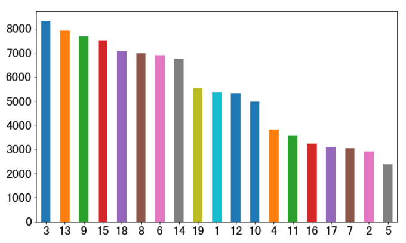
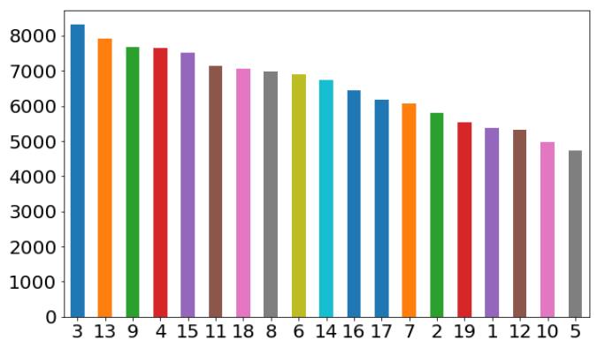

### 数据描述EDA

```python
# import

import os
import re
import pickle
import pandas as pd
import seaborn as sns
import matplotlib
import matplotlib.pyplot as plt
# from wordcloud import WordCloud, STOPWORDS
from gensim.models.word2vec import Word2Vec
from tqdm import tqdm_notebook as tqdm
```

```python
# 设置pandas的显示上限

pd.set_option('display.max_seq_items', 100)
pd.set_option('display.max_rows', 100)
pd.set_option('max_colwidth', 200)
```

```python
train_df['class'].value_counts().plot.bar(figsize=(10,6), fontsize=20, rot=0)
```



通过观察可以看到整个数据集class有19类

方案构建了一列stoi表，具体代码如下：

```python
# 建立label的stoi表
def create_lookup_table():
    c_class_lst = list(train_df['class'].value_counts().index)
    c_class_stoi = {c_class_lst[i]: i for i in range(len(c_class_lst))}
    return c_class_stoi
c_class_stoi = create_lookup_table()
pickle.dump(c_class_stoi, open('../../data/label_stoi.pkl', 'wb'))
c_numerical = [c_class_stoi[e] for e in train_df['class']]
train_df['c_numerical'] = c_numerical
train_df[:4]
print('类别共有：', len(c_class_stoi))
train_df[:1]
```

读取c_class_stoi 

```
{1: 9,
 2: 17,
 3: 0,
 4: 12,
 5: 18,
 6: 6,
 7: 16,
 8: 5,
 9: 2,
 10: 11,
 11: 13,
 12: 10,
 13: 1,
 14: 7,
 15: 3,
 16: 14,
 17: 15,
 18: 4,
 19: 8}
```

可以看到stoi其实只是对所有的Label 1-19做了一个排序，如label = 3，在value_counts中最大，排序为0。

构造的stoi表对应在c_numerical列，到现在train_df一共有五列

```python
['id', 'article', 'word_seg', 'class', 'c_numerical']
```

其后方案处理低频词，用来处理word_seg与artical两列。

```python
# 处理低频词
def construct_dict(df, d_type='word'):
    word_dict = {}
    corput = df.word_seg if d_type == 'word' else df.article
    for line in tqdm(corput):
        for e in line.strip().split():
            word_dict[e] = word_dict.get(e, 0) + 1
    return word_dict
word_dict = construct_dict(train_df, d_type='word')
char_dict = construct_dict(train_df, d_type='char')
word_stop_word = [e for e in word_dict if word_dict[e] <=2]
char_stop_word = [e for e in char_dict if char_dict[e] <=2]
pickle.dump(set(word_stop_word), open('../../data/word_stopword.pkl', 'wb'))
pickle.dump(set(char_stop_word), open('../../data/char_stopword.pkl', 'wb'))
```

训练集一共有102277列，取样word_seg的脱敏数据查看

使用strip().split()可以将脱敏字符串按空格隔开做分词

而word_dict得到的是该line所有word或article的词频

所以word_stop_word和char_stop_word得到的是所有词频<= 2的词频集合

word_stop_word和char_stop_word分别有529805和3361

```python
# 过滤低频词
def filter_low_freq(df):
    min_freq = 2
    word_seg_mf2 = []
    char_mf2 = []
    for w in tqdm(df.word_seg):
        word_seg_mf2.append(' '.join([e for e in w.split() if word_dict[e] > min_freq]))
    for w in tqdm(df.article):
        char_mf2.append(' '.join([e for e in w.split() if char_dict[e] > min_freq]))
    df['word_mf2'] = word_seg_mf2
    df['char_mf2'] = char_mf2
filter_low_freq(train_df)
train_df[:2]
```

其后使用过滤低频词的代码，将article和word_seg中的低频词过滤掉了

其后方案运行了一个check_len函数，这个函数的运行时间非常长。

```python
def check_len(df):
    s_dct = {}
    for s in df.article:
        s = [e for e in s.split() if e not in char_stop_word]
        s_dct[len(s)] = s_dct.get(len(s), 0) + 1
    l_lst = sorted(s_dct.items(), key=lambda x:x[0], reverse=False)
    sum(s_dct.values())
    p = 0.
    for l in l_lst:
        p += l[1] / sum(s_dct.values())
        print(str(l[0]) + '\t' + str(l[1]) + '\t' + str(p))
check_len(train_df)
# check_len(test_df)
len(train_df)
```

其后使用Word2vec训练了词向量，方式是先建立sentences，然后用gensim的word2vec训练model做无监督学习。当min_freq = 5, size = 100时保存的模型名称为word2vec.char.100d.mfreq5.model，可以看到type分成char和word只是命名用。

```python
from gensim.models.word2vec import Word2Vec
```

```python
# 训练词向量
def train_w2v_model(type='article', min_freq=5, size=100):
    sentences = []

    if type == 'char':
        corpus = pd.concat((train_df['article'], test_df['article']))
    elif type == 'word':
        corpus = pd.concat((train_df['word_seg'], test_df['word_seg']))
    for e in tqdm(corpus):
        sentences.append([i for i in e.strip().split() if i])
    print('训练集语料:', len(corpus))
    print('总长度: ', len(sentences))
    model = Word2Vec(sentences, size=size, window=5, min_count=min_freq)
    model.itos = {}
    model.stoi = {}
    model.embedding = {}
    
    print('保存模型...')
    for k in tqdm(model.wv.vocab.keys()):
        model.itos[model.wv.vocab[k].index] = k
        model.stoi[k] = model.wv.vocab[k].index
        model.embedding[model.wv.vocab[k].index] = model.wv[k]

    model.save('../../data/word2vec-models/word2vec.{}.{}d.mfreq{}.model'.format(type, size, min_freq))
    return model
model = train_w2v_model(type='char', size=100)
model = train_w2v_model(type='word', size=100)
# model.wv.save_word2vec_format('../../data/laozhu-word-300d', binary=False)
# train_df[:3]
print('OK')
```

训练保存了word2vec的结果后

方案在Jupyter内运行了一个train_lsa.py脚本，训练了tf-idf特征

```python
# 训练tf-idf特征
os.system('python train_lsa.py char 250')
```

train_lsa.py 代码如下

可以看到第一步，在系统内添加了相对路径 '../' 这样就可以从上级目录Import config.py中的Class Config

Config内设定cfg.TRAIN_X为NEW.Train.csv

当stopword.txt存在的时候，读取sw_list，不然令sw_list为空list

用append合并了train与test数据集之后

对TF-IDF后的数据做了一个TruncatedSVD，用make_pipeline使得这个变换同时作用在了train集和test集

然后保存了对应的pipeline和变换后的train 和 test 集


其中 sys.argv[1] 对应的feature 是语句os.system('python train_lsa.py char 250') 中的 char

sys.argv[2] 对应 250 在代码里赋值为n_dim

if len(sys.argv) != 3:
    exit()

这句话避免了 feature 和 n_dim 没有被赋值的情况

所以如果python train_lsa.py word 250

```python
import os
import pandas as pd
import pickle
import sys
sys.path.extend(['../'])
from config import Config

from sklearn.feature_extraction.text import TfidfVectorizer
from sklearn.decomposition import TruncatedSVD
from sklearn.pipeline import make_pipeline

cfg = Config()
train_df = pd.read_csv('../' + cfg.TRAIN_X)
test_df = pd.read_csv('../' + cfg.TEST_X)
try:
    sw_list = set(e.strip() for e in open('../../data/stopword.txt'))
except:
    sw_list = []
if len(sys.argv) != 3:
    exit()

feature = str(sys.argv[1])
n_dim = int(sys.argv[2])

train_X = []
test_X = []
corpus = train_df['word_seg'] if feature == 'word' else train_df['article']
corpus_test = test_df['word_seg'] if feature == 'word' else test_df['article']
for d in corpus:
    train_X.append(d)

for d in corpus_test:
    test_X.append(d)

vectorizer = TfidfVectorizer(ngram_range=(1,2),
                             stop_words=sw_list,
                             sublinear_tf=True,
                             use_idf=True,
                             norm='l2',
                             max_features=10000
                             )
# vectorizer = TfidfVectorizer(ngram_range=(1,2), min_df=3, max_df=0.9,use_idf=1,smooth_idf=1, sublinear_tf=1)

svd = TruncatedSVD(n_components=n_dim)
lsa = make_pipeline(vectorizer, svd)

print('Fit data...')
train_X = lsa.fit_transform(train_X)
test_X = lsa.transform(test_X)

print('save make pipeline')
os.makedirs('../../data/feature/', exist_ok=True)
with open('../../data/feature/make_pipeline_{}_{}.pkl'.format(feature, n_dim), 'wb') as f:
    pickle.dump(lsa, f)

print('save result')
with open('../../data/feature/train_x_{}_{}.pkl'.format(feature, n_dim), 'wb') as f:
    pickle.dump(train_X, f)

with open('../../data/feature/test_x_{}_{}.pkl'.format(feature, n_dim), 'wb') as f:
    pickle.dump(test_X, f)
print('done')

```

其后方案使用了一个数据增强的方案

对于数据量少于最大分类数据量一半的分类数据进行增强

增强方案为，将该分类数据的word_seg 和article split之后，shuffle打乱顺序，然后都添上一个' '空格之后与之前的分类数据合并。

```python
# 随机数添加数据
import random

def run_enhance():
    max_len = train_df['class'].value_counts().values[0]
    enhance_df = train_df.copy()[['article', 'word_seg', 'class', 'c_numerical']]
    
    for c in tqdm(enhance_df['class'].value_counts().index):
        c_data = enhance_df[enhance_df['class'] == c]
        if len(c_data) * 2 < max_len:
            for a, b, c_n in zip(c_data['word_seg'].values, c_data['article'].values, c_data['c_numerical'].values):
                a_lst = a.split()
                b_lst = b.split()
                random.shuffle(a_lst)
                random.shuffle(b_lst)
                a_str = ' '.join(a_lst)
                b_str = ' '.join(b_lst)
                enhance_df.loc[enhance_df.shape[0]+1] = {'article': b_str, 'word_seg': a_str, 'class': c, 'c_numerical':c_n}
    return enhance_df
enhance_df = run_enhance()
enhance_df.to_csv('../../data/Enhance.train.csv')
enhance_df['class'].value_counts().plot.bar(figsize=(10,6), fontsize=20, rot=0)
```

增强后，绘出图可以看到class = 4, 11, 16, 17,  7,  2 , 5 都被增强了一倍的数据量。



```python
# 卡方统计量提取数据
chi_dic = {}
enhance_df[:1]

N = len(train_df)

all_word = set((' '.join(train_df['word_seg'])).split())
all_char = set((' '.join(train_df['article'])).split())
```

train_df.shape[0] = 102277

all_word的长度len是875129

all_char的长度len是13516

```python
import numpy as np

def Feature_Select(df, mode='chi', feature='word', num=1000):  #  chi mi ig df ts
    all_text = []
    label_set = set()  # 'corpus_txt'
    feature = 'word_seg' if feature == 'word' else 'article'
    for idx, line in df.iterrows():
        data = line[feature].strip().split()
        all_text.append((line['c_numerical'], data))
        label_set.add(line['c_numerical'])
    categories = list(sorted(label_set))  # 排序，确保每次生成的类别列表顺序唯一
    cat_to_id = dict(zip(categories, range(len(categories))))
    print("类别列表id：", cat_to_id)

    word_text_map = {}
    label_num = [0] * len(categories)
    for text in all_text:
        label_i = cat_to_id[text[0]]
        label_num[label_i] += 1

        t = sorted(set(text[1]))  # 去重，并保持原来顺序，不保持原序结果不一样
        for w in t:
            if w not in word_text_map:
                word_text_map[w] = [0] * len(categories)
                word_text_map[w][label_i] += 1
            else:
                word_text_map[w][label_i] += 1

    N = len(all_text)
    print('文本总数量：', N)

    word_text_list = []
    word_list = []
    for k in word_text_map:
        word_list.append(k)
        word_text_list.append(word_text_map[k])
    
    A_array = np.array(word_text_list, dtype=np.float)  # A
    sign_array = np.sign(A_array)  # 当A=0时，chi=0
    word_num_each_label = np.sum(sign_array, 0)
    print('每个类别的词数量：', word_num_each_label)
    label_num = np.array(label_num, dtype=np.float)
    B_array = np.reshape(np.sum(word_text_list, 1), (-1, 1)) - A_array
    C_array = label_num - A_array
    D_array = N - A_array - B_array - C_array
    word_num = len(word_list)
    print('总词数：', word_num)

    def chi_label():
        # N * (AD - BC)^2  /  ((A+C)(B+D) (A+B)(C+D))   # 简化版 对于同一个类别：(AD - BC)^2  /  ((A+B)(C+D))
        chi_square_value = (A_array*D_array - B_array*C_array) ** 2 / ((A_array+B_array) * (C_array+D_array))
        # chi_square_value = (A_array*D_array - B_array*C_array) ** 2 * N / (
        #                         (A_array+C_array)*(B_array+D_array)*(A_array+B_array)*(C_array+D_array))
        chi_square_value = sign_array * chi_square_value
        
        feature_word = {}
        for i in range(len(categories)):
            cur_chi = chi_square_value[:, i]
            order = np.argsort(cur_chi)  # 返回排序后的索引，正向排序
            # print(word_num_each_label[i])
            min_n = min(num, int(word_num_each_label[i]))
            # top_80 = int(word_num_each_label[i] * 0.5)
            for i in order[-min_n:]:
                feature_word[i] = 1
        chose_w = [word_list[i] for i in feature_word]
        print('提取的特征词的数量：', len(chose_w))
        return chose_w
    
    def chi_mode(mode):
        # N * (AD - BC)^2  /  ((A+C)(B+D) (A+B)(C+D))   
        chi_square_value = (A_array*D_array - B_array*C_array) ** 2 * N / (
                                (A_array+C_array)*(B_array+D_array)*(A_array+B_array)*(C_array+D_array))
        chi_square_value = sign_array * chi_square_value
        
        if mode == 'max': chi_square_value = np.max(chi_square_value, axis=1).reshape((-1, 1))
        elif mode == 'avg': chi_square_value = np.mean(chi_square_value, axis=1).reshape((-1, 1))
        else: raise ValueError("参数有误")

        order = np.argsort(chi_square_value[:, 0])  # 返回排序后的索引，正向排序
        chose_w = [word_list[i] for i in order[-num:]]
        return chose_w
    return chi_label()
w_num = 100000
c_num = 20000
w = Feature_Select(train_df, num=w_num, feature='word')
c = Feature_Select(train_df, num=c_num, feature='char')
pickle.dump(w, open('../../data/chi_words_{}.pkl'.format(w_num), 'wb'))
pickle.dump(c, open('../../data/chi_char_{}.pkl'.format(c_num), 'wb'))
```

```python
pred1 = pickle.load(open('../../data/result-op5/lstmgruword_oof_f1_0.7686691377795438_a0.7832944028205417.pkl', 'rb'))
pred2 = pickle.load(open('../../backup/result-op3-0907/svmword_pre_f1_0.7755615966138534_a0.7900114681760386.pkl', 'rb'))

```

```python
def get_noise(pred):
    lines = []
    for i, p in enumerate(tqdm(pred)):
        top2 = np.sort(p)[-2:]
        if top2[0] >= 0.15 and top2[1] <= 0.7:
            lines.append(i)
    return lines
line1 = set(get_noise(pred1))
line2 = set(get_noise(pred2))
print(len(line1))
print(len(line2))
cross_noise = line1 & line2
cross_noise = list(cross_noise)
```

