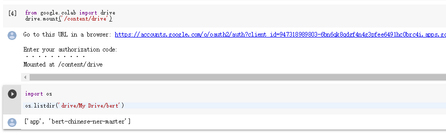
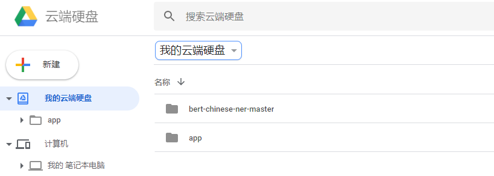
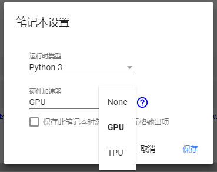
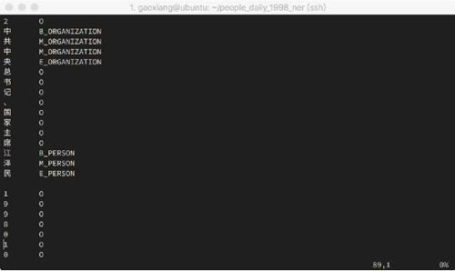
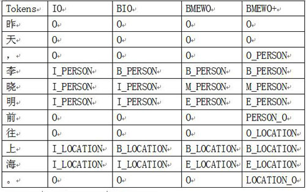

## Google Colab配置记录


Google Colab 地址

https://colab.research.google.com/notebooks/welcome.ipynb


Google 云端硬盘

https://drive.google.com/drive/folders/1YsSjZSshlAlbYgHafP-lrFwH6OFB9t3o


```python
from google.colab import drive
drive.mount('/content/drive')
```

需要进一个网址然后复制输入授权码



>  如果长一段时间不工作，或者运行时报错运行路径缺少某个文件夹，都需要重新import drive


可以看到现在工作目录'/content/drive/My Drive'  对应的就是Google账号云端硬盘的位置




在代码执行程序的部分可以配置，代码执行程序 -- >  更改运行时类型




更改工作目录到对应的文件夹下

```Python
import os
path = "/content/drive/My Drive/bert-chinese-ner-master"
os.chdir(path)
```


运行训练代码

```Python
!python BERT_NER.py \
				--data_dir=data/ \
				--bert_config_file=checkpoint/bert_config.json \
				--init_checkpoint=checkpoint/bert_model.ckpt \
				--vocab_file=vocab.txt \
				--output_dir=./output/result_dir/
```


运行评估及预测代码

```python
!python BERT_NER.py \
				--data_dir=data/ \
				--bert_config_file=checkpoint/bert_config.json \
				--init_checkpoint=checkpoint/bert_model.ckpt \
				--vocab_file=vocab.txt \
				--output_dir=./output/result_dir/ \
				--do_train=False \
				--do_eval=True \
				--do_predict=True
```


观察CRF模型所用的训练数据集



对于NER任务，常见的标签体系包括IO、BIO、BMEWO、BMEWO+。不同标签体系的区别。



可以看到有PERSON和LOCATION还有ORGANIZATION几种标签

其后有BME 就是 Begin， Middle， End 标签。


##### IOB 标注法

IOB 标注法， 是 CoNLL 2003 采用的标注法， I 表示 inside, O 表示 Outside, B 表示 Begin。而标注的 label是 I-XXX 的， 表示这个字符， 在 XXX类命名实体的内部(inside)。B用于标记一个命名实体的开始。

比如：

Tom B-PER
hanks I-PER
is O
my O
name O

#### BIOES

这是在 IOB方法上，扩展出的一个更复杂，但更完备的标注方法。其中 B表示这个词处于一个实体的开始(Begin), I 表示内部(inside), O 表示外部(outside), E 表示这个词处于一个实体的结束为止， S 表示，这个词是自己就可以组成一个实体(Single)

BIOES 是目前最通用的命名实体标注方法。

#### Markup

Makeup 是 OntoNotes 使用的标注方法， 思路比较简单, XML， 比如：

ENAMEX TYPE=”ORG”>DisneyENAMEX> is a global brand .

它用标签把 命名实体框出来， 然后，在 TYPE 上， 设置相应的类型。