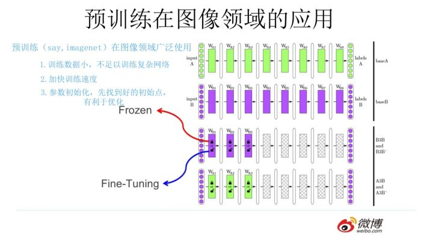

## NLP中的词向量对比

[nlp中的词向量对比](https://zhuanlan.zhihu.com/p/56382372)：

### 文本表示方法

基于one-hot、tf-idf、textrank等的bag-of-words；

> 存在维数灾难和语义鸿沟的问题

主题模型：LSA（SVD）、pLSA、LDA；

> 矩阵分解（LSA）：利用全局语料特征，但SVD求解计算复杂度大

基于词向量的固定表征：[word2vec](https://blog.csdn.net/itplus/article/details/37969519)、fastText、[glove](http://www.fanyeong.com/2018/02/19/glove-in-detail/#comment-1462)

> 分布式假设：相同上下文语境的词有似含义。
>
> 相比n-gram，解决分布式假设问题
>
> word2vec、fastText基于局部预料，glove基于全局语料库、并结合上下文语境构建词向量，结合了LSA和word2vec的优点

##### Word2vec

关键词：统计语言模型、Huffman树、n-gram模型、词向量、神经网络相比n-gram的优势、Distributed Representation、CBOW、Hierarchical softmax、随机梯度上升法、Skip-gram、Negative Sampling

> n-gram的实际应用中采用的是n = 3的三元模型，目前n>10已经成为可能
>
> CBOW，核心思想是从一个句子里面把一个词抠掉，用这个词的上文和下文去预测被抠掉的这个词。（英语完形填空）
>
> Skip-gram，和CBOW正好反过来，输入某个单词，要求网络预测它的上下文单词。

基于词向量的动态表征：elmo、GPT、[bert](https://www.jianshu.com/p/4dbdb5ab959b) （[bert课程](http://www.chinahadoop.cn/course/1253))

> 解决了固定表征无法解决一词多义的问题
>
> ELMO：“Embedding from Language Models” 对应论文“Deep contextualized word representation”，特征提取器RNN，LSTM，双向
>
> GPT是“Generative Pre-Training”的简称，两阶段，特征提取器Transformer，单向，只通过上文不通过下文，阅读理解更差
>
> Bert，两阶段，双向，语言模型数据规模大于GPT
>
> Bert借鉴了ELMO，GPT及CBOW，主要提出了Masked 语言模型及Next Sentence Prediction，但是这里Next Sentence Prediction基本不影响大局，而Masked LM明显借鉴了CBOW的思想。

语言模型NNLM、RNNLM

> 为了能够量化地衡量哪个句子更像一句人话，可以设计如上图所示函数，核心函数P的思想是根据句子里面前面的一系列前导单词预测后面跟哪个单词的概率大小（理论上除了上文之外，也可以引入单词的下文联合起来预测单词出现概率）。句子里面每个单词都有个根据上文预测自己的过程，把所有这些单词的产生概率乘起来，数值越大代表这越像一句人话。

[从Word Embedding到Bert模型—自然语言处理中的预训练技术发展史](https://zhuanlan.zhihu.com/p/49271699)

[对应Slides](https://pan.baidu.com/s/1o4SBdsx6dY4W4bnuBmU38Q?errno=0&errmsg=Auth%20Login%20Sucess&&bduss=&ssnerror=0&traceid=)

- word embedding无法区分多义词的不同语义，多义词在word2vec中预测结果相同，词向量的固定表征
- 一个非常明显的缺点在特征抽取器选择方面，ELMO使用了LSTM而不是新贵Transformer