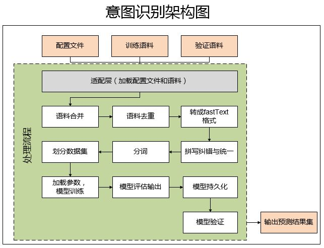

## 意图识别知识整理

（Intention Recognition）

意图识别是通过分类的办法将句子或者我们常说的query分到相应的意图种类,这在搜索引擎以及智能问答中都起很重要的作用。简单来说，就是当用户输入一句话或者一段文本时，意图识别可以准确识别出它是哪个领域的问题，然后分配给相应的领域机器人进行二次处理，这在问题分类很多的情况，可以明显提升问题匹配的准确度。

意图识别解决的问题：明白技术要替我们解决什么

我们搜索的时候如果涉及到一条信息对应多个分类的时候，这样搜索结果会比较差，但是如果我们通过意图识别发现用户是个游戏迷，我们就可以在用户搜索时将游戏的搜索结果优先返还给用户，这本身也是很有意义的一件事。

目前常用的意图识别的**基本方法**，有如下几种：

Ø 基于词典以及模版的规则方法

不同的意图会有的不同的领域词典，比如书名、歌曲名、商品名等等。我们根据用户的意图和词典的匹配程度或者重合程度来进行判断，最简单的一个规则是将该query判别给与词典重合程度高的domain。这个工作的重点便是领域词典必须得做地足够好。

Ø 基于机器学习模型来对用户的意图进行判别

这种主要是通过机器学习及深度学习的方式，对已标注好的领域的语料进行训练学习，得到一个意图识别的模型。利用该模型，当再输入一个测试集时，它能快速地预测出该语料对应的分类，并提供对应的置信度。使用这种方式的一个好处就是，在语料不断丰富后，模型的准确度会不断提升。 本文主要介绍的就是采用这种方式进行意图识别。

与业务自身的能力有关

**难点**

1. 数据来源匮乏，基本是有监督学习，标记数据要么去买，要么去爬
2. 意图识别分类种类很多，有很强的拓展性
   - 单个意图还好说，多个意图就比较麻烦，因为事先模型并不知道该分为多少个意图

**关于语料标注**

当前意图识别工作的难点有很多，最大的难点在于标注数据的获取。可采用的方式：

Ø 专门的数据标注团队对数据进行标注

Ø 通过对语料进行泛化，手动造出更多相似的语料

Ø 通过半监督的方式自动生成标注数据，然后再人工审核

- 文本分类标注

分类主要有2种方法：一是通过对文本阅读后直接判别，比如一些是否判定，情感分类等一些短文本的。二是需要对文本进行关键词提取，通过关键词标注进行分类判别，这种主要是针对一些长文本或者多轮对话中的应用场景。

- 文本抽取标注

文本抽取是对非结构化的文本内容中所需要的信息字段进行提取，主要运用于大量较为规范的文本场景中，比如合同，公告等。这一类标注的时候标注标准一定要统一化，少数相对独立的特征值标注更有利于后期模型训练的效果。

**可参考模型**

tfidf+SVM（文本评论）

深度语义匹配求句子相似度，（BIlstm+attention）先在通用大语料上训练基础模型，然后再迁移到小的业务语料上。应用时再结合规则模板和word2vec综合决策意图

fastText：参看参考文献思路

**关于模型调优**

模型的调优主要可以从以下几个方面入手：

Ø 如果清洗完的训练语料有分词不准的情况，需要增加相应的词林

Ø 对于分不准的类别，重着观察这一块的语料是否在训练语料中被分错了类别

Ø 模型的训练参数的调整

Ø 考虑增加其它模型进行模型的融合，保障最后的意图识别的性能

### 参考资料

[NLP系列学习：意图识别](https://zhuanlan.zhihu.com/p/41944121)

[基于fastText的意图识别框架](https://zhuanlan.zhihu.com/p/53297108)