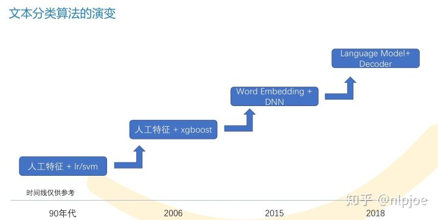
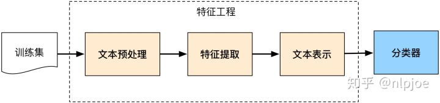

## 文本分类知识整理

本文整理主要基于[nlpjoe的文章](https://zhuanlan.zhihu.com/p/54397748)，在此基础上查阅资料做一些补充

可惜原作者并没有开源队伍的比赛源代码，只能根据[对应PPT](https://github.com/nlpjoe/2018-CCL-UIIMCS)学习一下他们冠军队的思路。

原作者说的比赛常用pipeline

- 去去低频词，选择合适的文本长度(文本预处理)
- 然后选点牛逼的词向量训练方法，做做加权或者拼接啥的(特征预处理)
- 套一些用烂的模型，最后融合(建模)
- 训练时打乱或者删词或者蒸馏(训练方式)
- **加上一些运气(比较重要)**

### 一、问题描述

文本分类任务的目标是想办法预测出文本对应的类别，是NLP的基础任务

机器学习和深度学习的文本分类pipeline都可以用这张图表示

只是区别在于：

- 机器学习提取的是如tf-idf的具体(concrete)特征
- 深度学习提取的是如词向量的抽象(abstract)特征

1. 做好文本表示工作，可以简单理解成词向量训练，即做好**“数据-->信息”**的流程
2. 做好分类器，可以理解成模型的设计，即做好**“信息-->知识”**的流程

### 二、文本表示

#### 2.1 语义粒度与文本长度

语义粒度是指对文本是否分词，以词还是以字来表示一个句子的输入特征。一般来讲，我们都需要对他们进行尝试，只要效果不相差太多，我们都需要保留，为最后的模型融合增加差异性。

文本长度我一般用占比95%或者98%的长度最为最大长度，对超过最大长度的句子进行截取，不足的进行填充(padding)。

另外就是对句子进行padding的时候，keras补0默认是补在前面，我想了下这应该是RNN结构的隐藏层参数空间最开始初始化为0，有个冷启动过程，所以我觉得补在前面是不错的。

#### 2.2 词向量选择

我们知道，Word2Vec和GloVe近几年在文本表示中几乎处于垄断地位，在比赛中几乎都是用他们来做文本表示，所以寻找好的词向量是比赛的关键点。如果数据没有脱敏，可以直接用github上训练好的词向量；否则就自己训练。

这里面有一个重要的trick是拼接Word2Vec和GloVe作为新的特征输入会对模型由一定提升效果，直接相加或者求平均效果通常都不好。

在单种词向量维度选择上，一般要费点时，加上拼接的话需要做的测试就更多了。而且不同模型上表现也不一样，最后大概率也选不到最佳维度，做这种事情心里都会觉得草蛋，但是心态要平和。这也是我为什么觉得态度端正，不要眼高手低非常重要。

当然，牛逼的人总是会想办法自动找一下最合适的词向量维度，感兴趣的同学可以看看NeurIPS 2018斯坦福的这篇论文《On the Dimensionality of Word Embedding》。

#### 2.3 语言模型词向量

今年做比赛是幸运的，因为新出了语言模型词向量，比较出名的是ULMFit、ELMo和BERT。他们的效果基本都能甩词向量几个点。

Word2Vec等词向量的缺点是只包含模型第一层的先验知识，模型的其余部分依旧需要从头训练。而语言模型改为采用分层表示的方式，用以解决语义依赖等问题。我们以ELMo为例：

他最低层先用词向量(比如Word2Vec)表示，然后再过两层双向LSTM语言模型，将三层的输出按一定方式组合作为特征表示。

比如这两句话：

> 我 今天 吃了 个 苹果 。 苹果 股价 又跌了 。

对“苹果”这个词，用Word2Vec表示，两个结果都是一样的；但是ELMo就能考虑上下文语义输出两种更符合语义的不同表示。

因为我们需要预训练语言模型，因此这就很像图像领域的迁移学习：先根据大规模语料训练好网络的一部分，然后用这部分网络接个分类器在小规模语料上重新finetune提高性能。

有了语言模型词向量最好的一点是，我们可以不用太纠结Word2Vec和GloVe的词向量维度选择了，可以选一个200维或者300维的最后再一起融合就好了。

### 三、模型介绍

我们已经通过文本表示技术将”文本数据转化为信息“，而文本分类模型就是将”信息转化为知识“。文本分类模型非常多，我们可以借鉴第一性原理去理解他们，会轻松一些。

我觉得文本分类最重要的是抓取关键词，而影响关键词抓取最重要的一点是文本的长度，就像人类做阅读题一样，越长的内容越难把握住重心。但是如果我们过于优化长文本性能，在短文本上的性能就会受到影响。因此我们关注的重点是：

- 关键词特征
- 长文本
- 短文本

我们将所有的神经网络组件和功能拆解，可以分成这几种：

这样看就很少了。功能解释都是我在亲自实验中的感悟，如果没看懂我解释一下。

对于短文本，CNN配合Max-pooling池化(如TextCNN模型)速度快，而且效果也很好。因为短文本上的关键词比较容易找到，而且Max-pooling会直接过滤掉模型认为不重要特征。虽然Attention也突出了重点特征，但是难以过滤掉所有低分特征。而Capsules效果比CNN好，所以我个人觉得在短文本上LSTM/GRU+Capusules是一个不错模型，这也是目前Kaggle Quora比赛上(短文本分类)最好的baseline之一。

但是对于长文本直接用CNN就不行了，在客服领域意图分类任务里，TextCNN会比HAN模型低十多个点，几乎没法用。当然我们可以在TextCNN前加一层LSTM，这样效果就能提升很多。

神经网络组件的功能大概就是这样，读者可以根据自己的理解尝试排列组合再调参。

下面简单介绍下笔者用过的两个比较经典的文本分类算法。当然比赛中用的模型可能有十个左右，所有的代码地址，我已经在文首交代过了。有兴趣可以看看。

#### 3.1 TextCNN

CNN家族在文本分类比较出名的就是Kim的TextCNN和kaiming的DPCNN，DPCNN我还没有跑出过比较好的结果，就介绍下TextCNN。

如果TextCNN卷积核宽度为2、3、4，每种卷积核的个数为2的话，那么它长这个样：

他的工作机制是：卷积窗口沿着长度为n的文本一个个滑动，类似于n-gram机制对文本切词，然后和文本中的每个词进行相似度计算，因为后面接了个Max-pooling，因此只会保留和卷积核最相近的词。这就是TextCNN抓取关键词的机制。

我一般喜欢在CNN前面加一层LSTM，效果相对不错。也可以把CNN换成Capsules组合成新模型。关于Capsules本文不多介绍了，有兴趣可以看看苏剑林大佬的博客和Capsules在[文本分类中的研究](https://zhuanlan.zhihu.com/p/35409788)。

#### 3.2 HAN模型

前几年Attention才出来的时候，一个段子说，只要一个LSTM+Attention就能通吃所以的NLP任务。这个模型确实有效，但是比较简单我就不介绍了。RNN族比较出名的文本分类模型是RCNN和HAN模型，这里介绍下HAN模型，其他的模型有兴趣的读者可以读论文或者看看我的代码。HAN的论文名称是《Hierarchical Attention Networks for Document Classification》，它长这个样子：

它主要是将长句按照句号划分成若干条句子，对每条句子用Attention做重要词特征抽取后进入下一级，下一级对所有的重要句做特征抽取后用MLP分类。更具体的可以看这个图：

**可能有读者会疑惑，那么对于脱敏文本怎么办呢？怎么识别句号？**在多个数据集上做个试验的朋友肯定知道，只要是正常的中文语料，训练词向量频次第二高的几乎都是句号，第一高的一般是逗号，随意截个图感受下：

因此大胆的用第二高频词划分，不放心再看看切分后的句子数量，在词和字级别上数量是否相等即可。因为如果第二高频词不是符号而是字，切分后的句子数量肯定是不等的。

我们用这个模型的时候尝试了下ELMo和Word2Vec的拼接，下面是一个HAN模型词向量拼接的模型，调一下参效果也还行，主要也还是为了最后的模型融合，增加模型多样性。

### 四、后处理

#### 4.1 模型融合

一般比赛做到最后都会有几十上百个模型结果，所以我也是很偷懒的用的oof(out-of-fold)文件做Stacking：

我们以达观杯为例，具体流程是：

1. 每个模型做交叉验证(比如10折)，然后把验证集得到的概率结果拼一起，组成一个oof训练集。比如达观杯的一个oof shape为(102722, 19)，因为有19个类别。
2. 假如我们有10个不同的模型，最后我们把10个oof结果拼一起(102722, 190)，再通过分类器拟合成(102722, 19)即可。
3. 对测试集的处理，把每个模型的加权平均即可。

俗话说一码胜千言，如果你看不懂我在说什么，建议你看一下下代码，非常少，也很容易理解。

#### 4.2 假标签(Pseudo Label)

假标签是一种半监督方法：

1. 通过训练集训练好的模型，去预测测试集的结果
2. 把测试集这个结果作为测试集的标签，和训练集混合在一起训练模型

一般模型能忍受10%的噪音，所以建议假标签方法不要一股脑把所有测试集和训练集混合，尽量保持比例在10：1附近。

### 参考资料

[如何到top5%？NLP文本分类和情感分析竞赛总结](https://zhuanlan.zhihu.com/p/54397748)

[Kaggle Quora-如何快速进行数据分析（内容分享demo）](https://zhuanlan.zhihu.com/p/54764693)