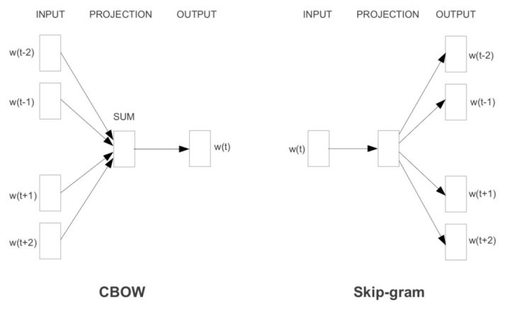

## 文本表示知识整理

做好文本表示工作，可以简单理解成词向量训练，即做好**“数据-->信息”**的流程

文本表示是NLP特征工程的一部分，在文本预处理和特征提取之后

主要涉及内容包括语义粒度，文本长度，词向量的选择，目前还有语言模型的选择和使用

目前最大热的框架就是BERT了，可以理解为语言模型的迁移学习框架

在此之前需要理解Word2vec，ELMo，Glove，Fasttext等之前的框架。

### word2vec

Google 2013

一个“线性”语言模型，可以实现线性的语义运算，如”皇帝-皇后=男-女“

word2vec的一个精髓是把语言模型的那一套softmax加速方法也给顺便优化了，用一个看似开脑洞的“负采样”方法来代替传统的层级softmax和NCE做法

训练语言模型时，要预测的是当前位置是哪个词，那么这个类别数就等同于词典规模，算softmax函数很费力。此时将问题转化为训练得到语言模型的副产物-词向量，那么其实只需要用这里隐含的一个计算代价更小的“子任务”就好啦。

想一想，给你10000张写有数字的卡片，让你找出其中的最大值，是不是特别费力？但是如果把里面的最大值事先抽出来，跟都五张随机抽取的卡片混到一起，让你选出其中的最大值，是不是就容易多啦？

负采样就是这个思想，即不直接让模型从整个词表找最可能的词了，而是直接给定这个词（即正例）和几个随机采样的噪声词（即采样出来的负例），只要模型能从这里面找出正确的词就认为完成目标。对应的目标函数为：

这里  是正例，  是随机采样出来的负例（采样k个），  是sigmoid函数。然后即最大化正例的似然，最小化负例的似然。

### char-level与上下文

char-level的文本中也蕴含了一些word-level的文本所难以描述的模式，因此一方面出现了可以学习到char-level特征的词向量FastText

另一方面在有监督任务中开始通过浅层CNN、HIghwayNet、RNN等网络引入char-level文本的表示

不过，至此为止，词向量都是上下文无关的。也就是说，同一个词在不同的语境中总是相同的词向量，很明显这就导致词向量模型缺乏词义消歧（WSD）的能力。于是，**人们为了让词向量变得上下文相关，开始在具体的下游任务中基于词向量sequence来做encoding。**

最常见的encoding方法当然就是用RNN系的网络，除此之外还有成功的用深层CNN来encoding的工作（如文本分类，机器翻译，机器阅读理解），然！而！Google说了，CNN也太俗了，我们要用全连接网络！self-attention！于是就有了为NLP深度定制的Transformer模型，Transformer的提出是在机器翻译任务上，但是其在其他领域如检索式对话上也发挥了巨大的威力。

不过，既然发现在各个NLP任务中基本都有encoding的需要，那么为啥不在最开始就让词向量拥有上下文相关的能力呢？于是有了ELMo。

### ELMo

产生上下文相关的词向量的语言模型，是一个让你有充分理由放弃word2vec的模型

ELMo在模型层上就是一个stacked bi-lstm（严格来说是训练了两个单向的stacked lstm），所以当然有不错的encoding能力。同时其源码实现上也支持用Highway Net或者CNN来额外引入char-level encoding。训练它的话自然也是语言模型标准的最大化似然函数，即

不过这个ELMo的亮点当然不在于模型层，而是其通过实验间接说明了在多层的RNN中，不同层学到的特征其实是有差异的，因此ELMo提出在预训练完成并迁移到下游NLP任务中时，要为原始词向量层和每一层RNN的隐层都设置一个可训练参数，这些参数通过softmax层归一化后乘到其相应的层上并求和便起到了weighting的作用，然后对“加权和”得到的词向量再通过一个参数来进行词向量整体的scaling以更好的适应下游任务。

> ps: 其实最后这个参数还是非常重要的，比如word2vec中，一般来说cbow和sg学出来的词向量方差差异比较大，这时那个方差跟适合下游任务后续层方差匹配的词向量就收敛更快，更容易有更好的表现

数学表达式如下

其中L=2就是ELMo论文中的设定，j=0时代表原始词向量层，j=1是lstm的第一隐层，j=2是第二隐层。  是参数被softmax归一化之后的结果（也就是说  ）。

通过这样的迁移策略，那些对词义消歧有需求的任务就更容易通过训练给第二隐层一个很大的权重，而对词性、句法有明显需求的任务则可能对第一隐层的参数学习到比较大的值（实验结论）。总之，这样便得到了一份”可以被下游任务定制“的特征更为丰富的词向量，效果比word2vec好得多也就不足为奇了。

不过话说回来，**ELMo的目标也仅仅是学习到上下文相关的、更强大的词向量，其目的依然是为下游任务提供一个扎实的根基，还没有想要弑君称王的意思**。

而我们知道，仅仅是对文本进行充分而强大的encoding（即得到每个词位非常精准丰富的特征）是远不够覆盖所有NLP任务的。在QA、机器阅读理解（MRC）、自然语言推理（NLI）、对话等任务中，还有很多更复杂的模式需要捕捉，比如句间关系。为此，下游任务中的网络会加入各种花式attention（参考NLI、MRC、Chatbot中的SOTA们）。

而随着捕捉更多神奇模式的需要，研究者们为每个下游任务定制出各种各样的网络结构，导致同一个模型，稍微一换任务就挂掉了，甚至在同一个任务的情况下换另一种分布的数据集都会出现显著的性能损失，这显然不符合人类的语言行为呀～要知道人类的generalization能力是非常强的，这就说明，或许现在整个NLP的发展轨迹就是错的，尤其是在SQuAD的带领下，穷尽各种trick和花式结构去刷榜，真正之于NLP的意义多大呢？

好像扯远了，不过所幸，这条越走越偏的道路终于被一个模型shutdown了，那就是几天前Google发布的Bidirectional Encoder Representations from Transformers (BERT).

### BERT

为每个NLP任务去深度定制泛化能力极差的复杂模型结构其实是非常不明智的

**预训练模型的潜力远不止为下游任务提供一份精准的词向量**

BERT作为一个general的龙骨级模型轻松的挑战了11个任务上的深度定制的模型

它里面已经充分的描述了字符级、词级、句子级甚至句间关系的特征，那么在不同的NLP任务中，只需要去为任务定制一个非常轻量级的输出层（比如一个单层MLP）就好了

**深层双向的encoding**

首先，它指出，对上下文相关的词向量的学习上，先前的预训练模型还不够！虽然在下游有监督任务中，encoding的方式已经是花里胡哨非常充分了，**深度双向encoding基本成了许多复杂下游任务的标配（比如MRC, dialogue）**。但是在预训练模型上，先前的最先进模型也只是基于传统的语言模型来做，**而传统的语言模型是单向的（数学上已经定义了）**，即

**而且往往都很浅**（想象一下LSTM堆三层就train不动了，就要上各种trick了），比如ELMo。

另外，虽然ELMo有用双向RNN来做encoding，但是这两个方向的RNN其实是分开训练的，只是在最后在loss层做了个简单相加。这样就导致对于每个方向上的单词来说，在被encoding的时候始终是看不到它另一侧的单词的。而显然句子中有的单词的语义会同时依赖于它左右两侧的某些词，仅仅从单方向做encoding是不能描述清楚的。

**那么为什么不像下游监督任务中那样做真正的双向encoding呢？**

原因一想就很清楚了，毕竟传统的语言模型是以预测下一个词为训练目标的，然而如果做了双向encoding的话，那不就表示要预测的词已经看到了嘛╮(￣▽￣””)╭这样的预测当然没有意义了。所以，在BERT中，提出了使用一种新的任务来训练监督任务中的那种真正可以双向encoding的模型，这个任务称为Masked Language Model （Masked LM）。

**Masked LM**

顾名思义，Masked LM就是说，我们不是像传统LM那样给定已经出现过的词，去预测下一个词，而是直接把整个句子的一部分词（随机选择）盖住（make it masked），这样模型不就可以放心的去做双向encoding了嘛，然后就可以放心的让模型去预测这些盖住的词是啥。这个任务其实最开始叫做cloze test（大概翻译成“完形填空测验”）。

这样显然会导致一些小问题。这样虽然可以放心的双向encoding了，但是这样在encoding时把这些盖住的标记也给encoding进去了╮(￣▽￣””)╭而这些mask标记在下游任务中是不存在的呀。。。那怎么办呢？对此，为了尽可能的把模型调教的忽略这些标记的影响，作者通过如下方式来告诉模型“这些是噪声是噪声！靠不住的！忽略它们吧！”，对于一个被盖住的单词：

- 有80%的概率用“[mask]”标记来替换
- 有10%的概率用随机采样的一个单词来替换
- 有10%的概率不做替换（虽然不做替换，但是还是要预测哈）

**Encoder**

在encoder的选择上，作者并没有用烂大街的bi-lstm，而是使用了可以做的更深、具有更好并行性的Transformer encoder来做。这样每个词位的词都可以无视方向和距离的直接把句子中的每个词都有机会encoding进来。另一方面我主观的感觉Transformer相比lstm更容易免受mask标记的影响，毕竟self-attention的过程完全可以把mask标记针对性的削弱匹配权重，但是lstm中的输入门是如何看待mask标记的那就不得而知了。

等下，小夕在之前的文章中也说过了，直接用Transformer encoder显然不就丢失位置信息了嘛？难道作者这里也像Transformer原论文中那样搞了个让人怕怕的sin、cos函数编码位置？并木有，作者这里很简单粗暴的直接去训练了一个position embedding ╮(￣▽￣””)╭ 这里就是说，比如我把句子截断到50的长度，那么我们就有50个位置嘛，所以就有50个表征位置的单词，即从位置0一直到位置49。。。然后给每个位置词一个随机初始化的词向量，再随他们训练去吧（很想说这特喵的也能work？太简单粗暴了吧。。。）。另外，position embedding和word embedding的结合方式上，BERT里选择了直接相加。

最后，在深度方面，最终BERT完全版的encoder丧心病狂的叠加了24层的multi-head attention block（要知道对话里的SOTA模型DAM也才用了5层…）。。。而且每个block包含16抽头、1024隐单元╮(￣▽￣””)╭此处打出标语：money is all you need （划掉）

**学习句子与句对关系表示**

像之前说的，在很多任务中，仅仅靠encoding是不足以完成任务的（这个只是学到了一堆token级的特征），还需要捕捉一些句子级的模式，来完成SLI、QA、dialogue等需要句子表示、句间交互与匹配的任务。对此，BERT又引入了另一个极其重要却又极其轻量级的任务，来试图把这种模式也学习到。

**句子级负采样**

还记得小夕在前面word2vec章节说过的，word2vec的一个精髓是引入了一个优雅的负采样任务来学习词向量（word-level representation）嘛。那么如果我们把这个负采样的过程给generalize到sentence-level呢？这便是BERT学习sentence-level representation的关键啦。

BERT这里跟word2vec做法类似，不过构造的是一个句子级的分类任务。即首先给定的一个句子（相当于word2vec中给定context），它下一个句子即为正例（相当于word2vec中的正确词），随机采样**一个**句子作为负例（相当于word2vec中随机采样的词），然后在该sentence-level上来做二分类（即判断句子是当前句子的下一句还是噪声）。通过这个简单的句子级负采样任务，BERT就可以像word2vec学习词表示那样轻松学到句子表示啦。

**句子级表示**

等等，前面说了这么半天，还没有说句子该怎么表示呢。。。

BERT这里并没有像下游监督任务中的普遍做法一样，在encoding的基础上再搞个全局池化之类的，它首先在每个sequence（对于句子对任务来说是两个拼起来的句子，对于其他任务来说是一个句子）前面加了一个特殊的token，记为[CLS]，如图

> ps：这里的[sep]是句子之间的分隔符，BERT同时支持学习句对的表示，这里是[SEP]便是为了区分句对的切割点。

然后让encoder对[CLS]进行深度encoding，深度encoding的最高隐层即为整个句子/句对的表示啦。这个做法乍一看有点费解，不过别忘了，Transformer是可以无视空间和距离的把全局信息encoding进每个位置的，而[CLS]作为句子/句对的表示是直接跟分类器的输出层连接的，因此其作为梯度反传路径上的“关卡”，当然会想办法学习到分类相关的上层特征啦。

另外，为了让模型能够区分里面的每个词是属于“左句子”还是“右句子”，作者这里引入了“segment embedding”的概念来区分句子。对于句对来说，就用embedding A和embedding B来分别代表左句子和右句子；而对于句子来说，就只有embedding A啦。这个embedding A和B也是随模型训练出来的。

> ps: 这做法跟position embedding一样感觉简单粗暴，实在很费解为什么BERT用在“quora question pairs”这种理论上需要网络保持对称的任务上依然能work，心情复杂

所以最终BERT每个token的表示由token原始的词向量token embedding、前文提到的position embedding和这里的segment embedding三部分相加而成，如图：

**简洁到过分的下游任务接口**

真正体现出BERT这个模型是龙骨级模型而不再是词向量的，就是其到各个下游任务的接口设计了，或者换个更洋气的词叫迁移策略。
首先，既然句子和句子对的上层表示都得到了，那么当然对于文本分类任务和文本匹配任务（文本匹配其实也是一种文本分类任务，只不过输入是文本对）来说，只需要用得到的表示（即encoder在[CLS]词位的顶层输出）加上一层MLP就好了呀～

既然文本都被深度双向encoding了，那么做序列标注任务就只需要加softmax输出层就好了呀，连CRF都不用了呀～

让小夕更木有想到的是，在span抽取式任务如SQuAD上，把深度encoding和深度attention这俩大礼包省掉就算了，甚至都敢直接把输出层的pointer net给丢掉了？直接像DrQA那样傲娇的用两个线性分类器分别输出span的起点和终点？不多说了，已跪m(_ _)m

最后来看一下实验效果

### 参考资料

[NLP的游戏规则从此改写？从word2vec, ELMo到BERT](https://zhuanlan.zhihu.com/p/47488095)