## 爬虫学习笔记


笔记全部来源微信公众号《学习python的正确姿势》，由于是笔记，只为提取我需要的重点信息，作者帅b老仙的原文会知识更多且更有趣一点。

欢迎支持作者和打赏入群。


### 目录

- [爬虫是怎么玩的？](#爬虫是怎么玩的？)
- [在Chrome浏览器轻松抓包](#在Chrome浏览器轻松抓包)
- [urllib库](#urllib库)
- [requests库](#requests库)
- [正则：re](#正则：过滤服务器返回的源码)
- [实践：爬取当当网Top500本五星好评书籍](#实践：爬取当当网 Top 500 本五星好评书籍)
- [高效的网页解析库：BeautifulSoup](#高效的网页解析库：BeautifulSoup)
- [实践：爬取豆瓣最受欢迎的250部电影](#实践：爬取豆瓣最受欢迎的250部电影)

- [如何伪装自己不被封ip？](#如何伪装自己不被封ip)
- [碰到需要登录的网站怎么办？](#碰到需要登录的网站怎么办？)


### 爬虫是怎么玩的？

在互联网上许许多多的网站它们都是托管在服务器上的，这些服务器 24 小时运行着，时时刻刻，兢兢业业的等待着别人的请求，所以，我们的爬虫，首先会模拟请求，就好像你在浏览器输入网址，然后回车那样，爬虫可以用到一些 Http 库向指定的服务器偷偷摸摸的发起请求，这个时候爬虫可以假装自己是浏览器（添加一些header信息），大多数的服务器呢，傻不拉的以为是浏览器发送请求，就直接返回数据给爬虫了。


### 在 Chrome 浏览器轻松抓包

#### 请求

国产浏览器，很多是有后门的，尽量不要用

打开chrome

进入www.baidu.com

按下F12，可以看到Element 标签下对应的 HTML 代码

点击 Network 这个标签，刷新一下，可以看到很多请求

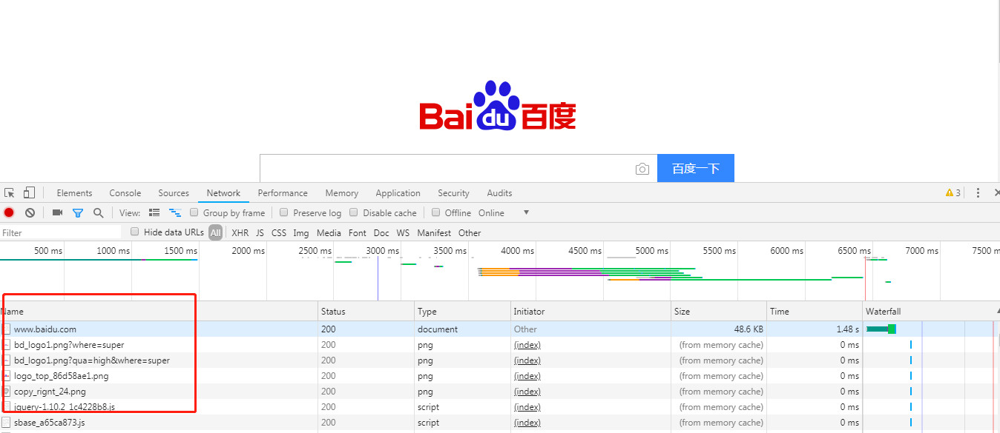

HTTP 的请求方式有好几种，

GET, POST, PUT, DELETE, HEAD, OPTIONS, TRACE

不过最常见的就是 GET 和 POST 请求


##### GET请求

https://www.baidu.com/s?wd=%E8%8B%8D%E8%80%81%E5%B8%88&rsv_spt=1&rsv_iqid=0xad707ee600011b25&issp=1&f=8&rsv_bp=1&rsv_idx=2&ie=utf-8&rqlang=cn&tn=baiduhome_pg&rsv_enter=0&oq=%25E8%258B%258D%25E8%2580%2581%25E5%25B8%2588&rsv_t=5d8eqNDy4ZpyUOz7ByzyIMYfH5Jc7861dr4CFQaY3WCiDnOpBLob6Eouk23%2F3L%2BTD46O&rsv_sug3=15&rsv_pq=996e776f0000df06&rsv_sug4=19123

在 ？后面的这些 jb 玩意儿就是 GET 请求的参数，这些参数以「键值对」的形式实现

比如这里的

wd=%E8%8B%8D%E8%80%81%E5%B8%88

所以以后我们在 Python 写 GET 请求的时候，直接在 URL 后面加个 ？然后添加参数值就好了。如：https://www.baidu.com/s?wd=波多野结衣


##### POST请求

我们在做一些**信息提交**的时候， 比如注册，登录，这时候我们做的就是 POST 请求，POST 的参数不会直接放在 URL 上，会以 Form 表单的形式将数据提交给服务器。

当我们点击登录的时候，就开始将我们的账号密码请求给百度服务器，可以看到我们请求了 login 这个接口，请求方法就是 POST。

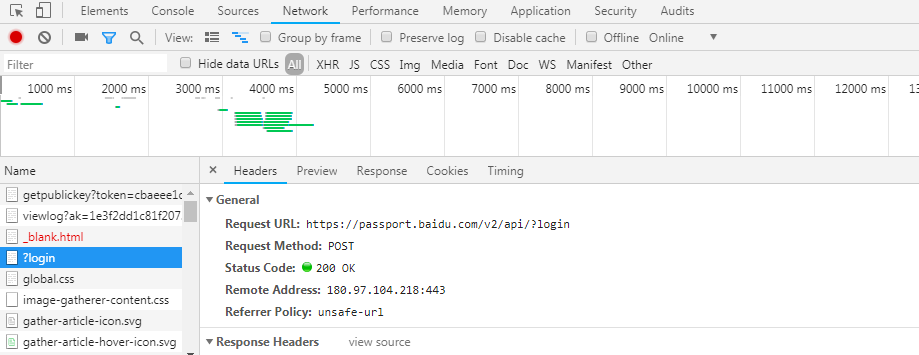

而我们的请求参数是以 Form 表单的方式提交的

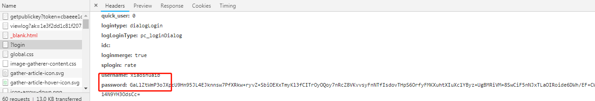

username 就是 xiaoshuaib

而密码，就是被加密了的，这些都是 POST 参数

GET请求把请求参数都暴露在URL上，而POST请求的参数放在request body 里面，POST请求方式还对密码参数加了密，这样就相对安全一些


ok

你已经了解请求方式了

接下来说说**请求头**


##### 请求头

我们刚刚在访问百度的时候，可以看到

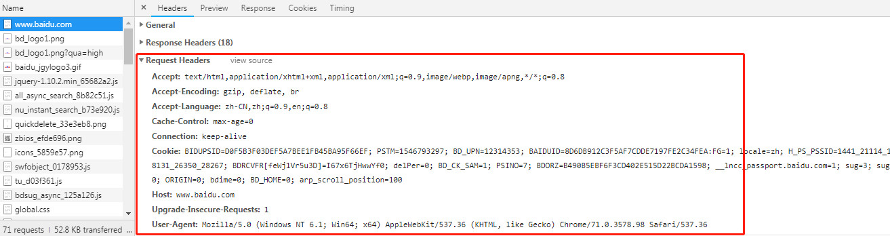

这个就是请求头，**Request Header**

我们在做 HTTP 请求的时候，除了提交一些参数之外，我们还有定义一些 HTTP 请求的头部信息，比如 Accept、Host、cookie、User-Agent等等，这些参数也是我们在做爬虫要用到，通过这些信息，欺骗服务器，告诉它我们是正规请求。

比如，我们可以在代码里面设置 cookie 告诉服务器我们就是在这个浏览器请求的会话，User-Agent 告诉服务器我们是浏览器请求的。


#### 响应

##### 服务器响应

 404 啊，200啊，301啊，502啊，都是服务器的响应码，一般服务器给我们返回 200，那就说明，我们成功请求了。


##### 响应头

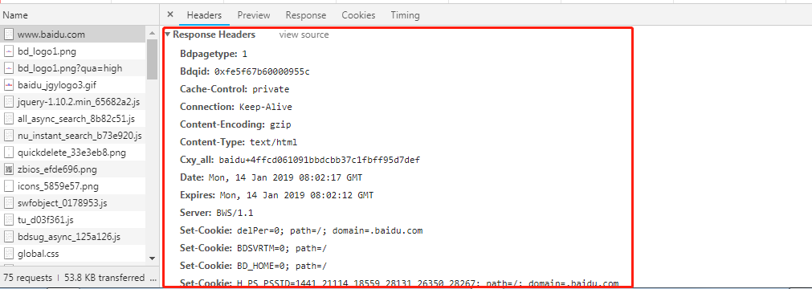

当我们请求成功之后，服务器会给我们返回响应码之外，还有响应头。


##### 响应体

服务器返回给我们的数据，点击 Response 就可以看到相关的数据了

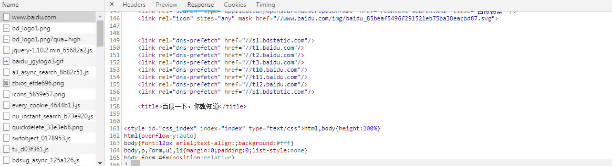

服务器返回给我们的 HTML 源代码，对于不同的请求，我们获取到的数据是不一样的，

除了 HTML的，也有 JSON 的，图片二进制数据等等，可以针对不同的情况，用不同的手段来解析这些数据。


### urllib 库

Python 这个内置的 Urllib 库

- request，是我们用的比较多的，就是用它来发起请求
- error，当我们在使用 request 模块遇到错了，就可以用它来进行异常处理
- parse，用来解析我们的 URL 地址的，比如解析域名地址啦，URL指定的目录等
- robotparser，这个用的就比较少了，它就是用来解析网站的 robot.txt


#### urlopen 模拟请求百度

```python
import urllib.request

urllib.request.urlopen('http://www.baidu.com')
response = urllib.request.urlopen('http://www.baidu.com')

print(response.read().decode('utf-8'))
```

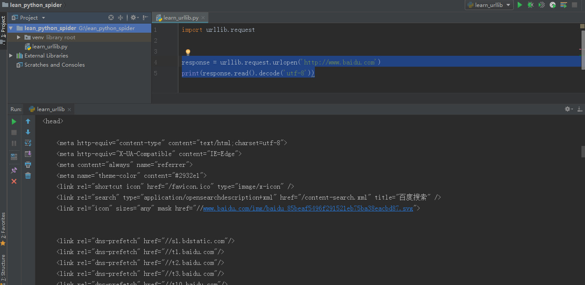


主要参数

```python
urllib.request.urlopen(url, data=None, [timeout, ]*)
```

- url : 我们请求的链接

- data : 专门给我们 post 请求携带参数

  > 比如我们在登录的时候，可以把用户名密码封装成 data 传过去，
  >
  > 在这里的 data 的值我们可以用 byte 的类型传递

- timeout : 设置请求超时时间


#### request 欺骗服务器说我们是浏览器或者手机请求

```python
urllib.request.Request(url, data=None, headers={}, method=None)
```

我们除了定义 url 和 data 之外，我们还可以定义请求头信息

urlopen 默认是 Get 请求，当我们传入参数它就为 Post 请求了，

而 Request 可以让我们自己定义请求的方式，这样我们就可以使用 Request 来封装我们的请求信息


```python
# 导入 urllib
from urllib import request,parse

# 这里我们还要导入 ssl,因为网站用的是 https,我们可以使用 ssl 未经验证的上下文
import ssl
context = ssl._create_unverified_context()

# 接着定义一下我们的请求 url 和 header
url = 'https://biihu.cc//account/ajax/login_process/'
headers = {
    #假装自己是浏览器
    'User-Agent':' Mozilla/5.0 (Windows NT 6.1; Win64; x64) AppleWebKit/537.36 (KHTML, like Gecko) Chrome/71.0.3578.98 Safari/537.36',
}

# 再定义一下我们的请求参数

dict = {
    'return_url':'https://biihu.cc/',
    'user_name':'xiaoshuaib@gmail.com',
    'password':'123456789',
    '_post_type':'ajax',
}

# 我们把请求的参数转化为 byte
data = bytes(parse.urlencode(dict),'utf-8')

# 然后我们就可以封装 request 了
req = request.Request(url,data=data,headers=headers,method='POST')

# 最后我们进行请求
response = request.urlopen(req,context=context)
print(response.read().decode('utf-8'))
```

我们就模拟登录了

```json
# 运行一下看看

{"rsm":{"url":"https:\/\/biihu.cc\/home\/first_login-TRUE"},"errno":1,"err":null}
```


### Reuqests库

Requests 是在 urllib 的基础上搞出来的

```shell
pip install requests
```

```python
# 导入 requests 模块
import requests

# 一行代码 Get 请求
r = requests.get('https://api.github.com/events')

# 一行代码 Post 请求
r = requests.post('https://httpbin.org/post', data = {'key':'value'})

# 其它乱七八糟的 Http 请求
>>> r = requests.put('https://httpbin.org/put', data = {'key':'value'})

>>> r = requests.delete('https://httpbin.org/delete')

>>> r = requests.head('https://httpbin.org/get')

>>> r = requests.options('https://httpbin.org/get')

# 想要携带请求参数是吧？
>>> payload = {'key1': 'value1', 'key2': 'value2'}

>>> r = requests.get('https://httpbin.org/get', params=payload)

# 假装自己是浏览器
>>> url = 'https://api.github.com/some/endpoint'

>>> headers = {'user-agent': 'my-app/0.0.1'}

>>> r = requests.get(url, headers=headers)

# 获取服务器响应文本内容
>>> import requests

>>> r = requests.get('https://api.github.com/events')

>>> r.text

u'[{"repository":{"open_issues":0,"url":"https://github.com/...

>>> r.encoding

'utf-8'

# 获取字节响应内容
>>> r.content

b'[{"repository":{"open_issues":0,"url":"https://github.com/...

# 获取响应码
>>> r = requests.get('https://httpbin.org/get')

>>> r.status_code

200

# 获取响应头
>>> r.headers

{    
    'content-encoding': 'gzip',    
    'transfer-encoding': 'chunked',  
    'connection': 'close',    
    'server': 'nginx/1.0.4',    
    'x-runtime': '148ms',    
    'etag': '"e1ca502697e5c9317743dc078f67693f"',   
    'content-type': 'application/json'
    
}

# 获取 Json 响应内容
>>> import requests

>>> r = requests.get('https://api.github.com/events')

>>> r.json()

[{u'repository': {u'open_issues': 0, u'url': 'https://github.com/...
                  
# 获取 socket 流响应内容
>>> r = requests.get('https://api.github.com/events', stream=True)

>>> r.raw

<urllib3.response.HTTPResponse object at 0x101194810>

>>> r.raw.read(10)

'\x1f\x8b\x08\x00\x00\x00\x00\x00\x00\x03'
                  
# Post请求

# 当你想要一个键里面添加多个值的时候
>>> payload_tuples = [('key1', 'value1'), ('key1', 'value2')]

>>> r1 = requests.post('https://httpbin.org/post', data=payload_tuples)

>>> payload_dict = {'key1': ['value1', 'value2']}

>>> r2 = requests.post('https://httpbin.org/post', data=payload_dict)

>>> print(r1.text)

{  ...  "form": {    "key1": [      "value1",      "value2"    ]  },  ...}

>>> r1.text == r2.text

True
                  
# 请求的时候用 json 作为参数
>>> url = 'https://api.github.com/some/endpoint'

>>> payload = {'some': 'data'}

>>> r = requests.post(url, json=payload)

# 想上传文件？
>>> url = 'https://httpbin.org/post'

>>> files = {'file': open('report.xls', 'rb')}

>>> r = requests.post(url, files=files)

>>> r.text

{  ...  "files": {    "file": "<censored...binary...data>"  },  ...}

# 获取 cookie 信息
>>> url = 'http://example.com/some/cookie/setting/url'

>>> r = requests.get(url)

>>> r.cookies['example_cookie_name']

'example_cookie_value'

# 发送 cookie 信息
>>> url = 'https://httpbin.org/cookies'

>>> cookies = dict(cookies_are='working')

>>> r = requests.get(url, cookies=cookies)

>>> r.text

'{"cookies": {"cookies_are": "working"}}'

# 设置超时
>>> requests.get('https://github.com/', timeout=0.001)

Traceback (most recent call last):
  File "<stdin>", line 1, in <module>requests.exceptions.Timeout: HTTPConnectionPool(host='github.com', port=80): Request timed out. (timeout=0.001)
```


### 正则：过滤服务器返回的源码

正则表达式就是定义一些特殊的符号，来匹配不同的字符

比如\d就可以代表一个数字，等价于 0-9 的任意一个


这是各种符号的解释

通俗的把最常用的匹配告诉你

|   字符   |                             描述                             |
| :------: | :----------------------------------------------------------: |
|    \d    |         代表任意数字，就是阿拉伯数字 0-9 这些玩意。          |
|   `\D`   | 大写的就是和小写的唱反调，\d 你代表的是任意数字是吧？那么我 \D 就代表不是数字的。 |
|   `\w`   |      代表字母，数字，下划线。也就是 a-z、A-Z、0-9、_。       |
|   `\W`   |     跟 \w 唱反调，代表不是字母，不是数字，不是下划线的。     |
|    \n    |                        代表一个换行。                        |
|   `\r`   |                        代表一个回车。                        |
|   `\f`   |                          代表换页。                          |
|   `\t`   |                       代表一个 Tab 。                        |
|   `\s`   |     代表所有的空白字符，也就是上面这个：\n、\r、\t、\f。     |
|   `\S`   |            跟 \s 唱反调，代表所有不是空白的字符。            |
|   `\A`   |                      代表字符串的开始。                      |
|   `\Z`   |                      代表字符串的结束。                      |
|    ^     |                    匹配字符串开始的位置。                    |
|    $     |                    匹配字符创结束的位置。                    |
|    .     |                代表所有的单个字符，除了 \n \r                |
| `[...]`  |     代表在 [] 范围内的字符，比如 [a-z] 就代表 a到z的字母     |
| `[^...]` |          跟 [...] 唱反调，代表不在 [] 范围内的字符           |
|   {n}    | 匹配在 {n} 前面的东西，比如: o{2} 不能匹配 Bob 中的 o ，但是能匹配 food 中的两个o。 |
| `{n,m}`  | 匹配在 {n,m} 前面的东西，比如：o{1,3} 将匹配“fooooood”中的前三个o。 |
| `{n，}`  | 匹配在 {n,} 前面的东西，比如：o{2,} 不能匹配“Bob”中的“o”，但能匹配“foooood”中的所有o。 |
|   `*`    | 和 {0,} 一个样，匹配 * 前面的 0 次或多次。 比如 zo* 能匹配“z”、“zo”以及“zoo”。 |
|   `+`    | 和{1，} 一个样，匹配 + 前面 1 次或多次。 比如 zo+”能匹配“zo”以及“zoo”，但不能匹配“z”。 |
|   `？`   |          和{0,1} 一个样，匹配 ？前面 0 次或 1 次。           |
|   a\|b   |                       匹配 a 或者 b。                        |
|  `（）`  |                     匹配括号里面的内容。                     |


#### python的正则库：re

##### re.match

定义出相应的匹配规则

```python
import re

content = 'Xiaoshuaib has 100 bananas'
res = re.match('^Xi.*(\d+)\s.*s$',content)
print(res.group(1))

>>> 0

content = 'Xiaoshuaib has 100 bananas'
res = re.match('^Xi.*?(\d+)\s.*s$',content)
print(res.group(1))

>>> 100
```

第二段代码多了一个？


贪婪匹配：一个数一个数都要去匹配

非贪婪匹配：直接匹配出100

刚刚我们用到的 **.\*？**，是我们在匹配过程中最常使用到的，表示的就是匹配任意字符


如果字符串有换行了，直接用 re.S 就可以了

```python
import re

content = """Xiaoshuaib has 100 
bananas"""
res = re.match('^Xi.*?(\d+)\s.*s$',content,re.S)
print(res.group(1))
```


##### re.search

直接去扫描字符串，然后把匹配成功的**第一个**结果的返回给你

```python
import re

content = """Xiaoshuaib has 100 
bananas"""
res = re.search('Xi.*?(\d+)\s.*s',content,re.S)
print(res.group(1))
```


##### re.findall

通过它我们能轻松的获取所有匹配的内容了

```python
import re

content = """Xiaoshuaib has 100 bananas;
Xiaoshuaib has 100 bananas;
Xiaoshuaib has 100 bananas;
Xiaoshuaib has 100 bananas;"""
res = re.findall('Xi.*?(\d+)\s.*?s;',content,re.S)
print(res)

>>> ['100', '100', '100', '100']
```


##### re.sub

直接替换匹配的内容

```python
import re

content = """Xiaoshuaib has 100 bananas;
Xiaoshuaib has 100 bananas;
Xiaoshuaib has 100 bananas;
Xiaoshuaib has 100 bananas;"""
content = re.sub('\d+','250',content)
print(content)
```


##### re.compile

把我们的匹配符封装一下，便于以后复用

```python
import re

content = "Xiaoshuaib has 100 bananas"
pattern = re.compile('Xi.*?(\d+)\s.*s',re.S)
res = re.match(pattern,content)

print(res.group(1))

# 等价于
res = re.match('^Xi.*?(\d+)\s.*s$',content,re.S)
```


### 实践：爬取当当网 Top 500 本五星好评书籍


#### 第一步：对我们的目标网站进行分析

打开地址

http://bang.dangdang.com/books/fivestars/01.00.00.00.00.00-recent30-0-0-1-1

每一页显示 20 本书，当我们点击下一页的时候

你可以发现地址变了

http://bang.dangdang.com/books/fivestars/01.00.00.00.00.00-recent30-0-0-1-2

也就是我们翻到第几页的时候，链接地址的最后一个参数会跟着变

那么我们等会在 python 中可以用一个变量，来实现获取不同页数的内容


#### 第二步：分析我们要的内容是怎么请求的，以及返回给我们的源代码是什么样的

通过chrome可以观察GET请求，我们的请求头和响应体

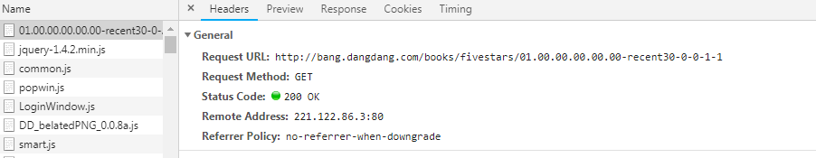

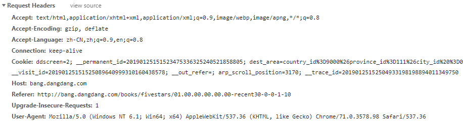

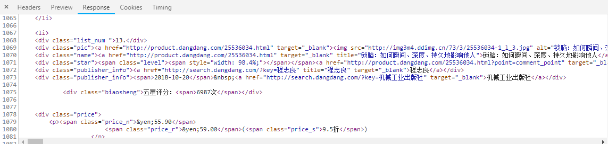

接着我们再来分析一下我们要抓取的关键信息


我们要的就是前 500 本书的

- 排名

- 书名

- 图片地址

- 作者

- 推荐指数

- 五星评分次数

- 价格

通过源码我们可以看到，这些信息被放在了 <li> 标签中

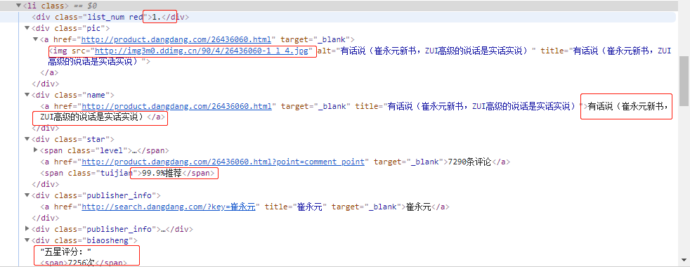

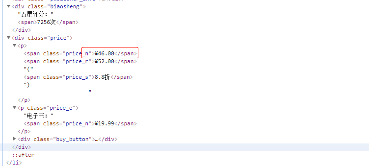


#### 第三步：梳理主要思路

- 使用 page 变量来实现翻页

- 我们使用 requests 请求当当网

- 然后将返回的 HTML 进行正则解析

- 解析完之后就把内容存到文件中


#### 第四步：实操

```python
def main(page):
   url = 'http://bang.dangdang.com/books/fivestars/01.00.00.00.00.00-recent30-0-0-1-' + str(page)
   html = request_dandan(url)
   items = parse_result(html) # 解析过滤我们想要的信息
   
   for item in items:
       write_item_to_file(item)
        
def request_dandan(url):
   try:
       response = requests.get(url)
       if response.status_code == 200:
           return response.text
   except requests.RequestException:
       return None

# 使用正则解析关键信息
# 获取到了之后我们封装一下数据
def parse_result(html):
   pattern = re.compile('<li>.*?list_num.*?(\d+).</div>.*?.*?class="star">.*?class="tuijian">(.*?)</span>.*?class="publisher_info">.*?target="_blank">(.*?)</a>.*?class="biaosheng">.*?<span>(.*?)</span></div>.*?<p><span\sclass="price_n">&yen;(.*?)</span>.*?</li>',re.S)
   items = re.findall(pattern,html)
   for item in items:
       yield {
           'range': item[0],
           'iamge': item[1],
           'title': item[2],
           'recommend': item[3],
           'author': item[4],
           'times': item[5],
           'price': item[6]
       }
```


打印一下看看结果

```python
for item in items:
       print(item)
```

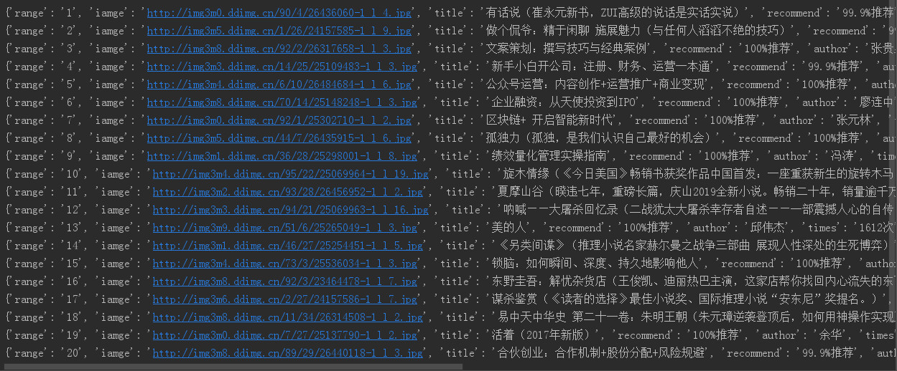

这是第一页的数据

自动获取 25 页 500 条数据呢，跑个循环：

```python
if __name__ == "__main__":
   for i in range(1,26):
       main(i)
```

存到book.txt 文件

```python
def write_item_to_file(item):
   print('开始写入数据 ====> ' + str(item))
   with open('book.txt', 'a', encoding='UTF-8') as f:
       f.write(json.dumps(item, ensure_ascii=False) + '\n')
       f.close()
```


### 高效的网页解析库：BeautifulSoup

一个可以从 HTML 或 XML 文件中提取数据的 Python 库

```
pip install beautifulsoup4
pip install lxml
```

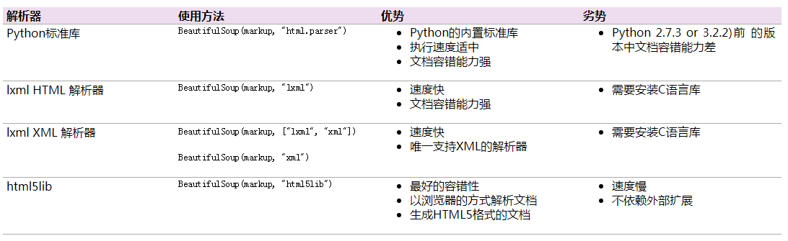


举例解析

```html
html_doc = """

<html><head><title>学习python的正确姿势</title></head>
<body>
<p class="title"><b>小帅b的故事</b></p>

<p class="story">有一天，小帅b想给大家讲两个笑话
<a href="http://example.com/1" class="sister" id="link1">一个笑话长</a>,
<a href="http://example.com/2" class="sister" id="link2">一个笑话短</a> ,
他问大家，想听长的还是短的？</p>

<p class="story">...</p>

"""
```

将 html 的源代码传给 BeautifulSoup

```python
soup = BeautifulSoup(html_doc,'lxml')

# 获取标题的内容
print(soup.title.string)
>>> 学习python的正确姿势

# 获取 p 标签里面的内容
print(soup.p.string)
>>> 小帅b的故事

# 获取 title 的父级标签
print(soup.title.parent.name)
>>> head

# 获取超链接
print(soup.a)
>>> <a class="sister" href="http://example.com/1" id="link1">一个笑话长</a>

# 获取所有超链接
print(soup.find_all('a'))
>>> [<a class="sister" href="http://example.com/1" id="link1">一个笑话长</a>, <a class="sister" href="http://example.com/2" id="link2">一个笑话短</a>]

# 获取 id 为 link2 的超链接
print(soup.find(id="link2"))
>>> <a class="sister" href="http://example.com/2" id="link2">一个笑话短</a>

# 获取网页中所有的内容
print(soup.get_text())

>>> 学习python的正确姿势

小帅b的故事
有一天，小帅b想给大家讲两个笑话
一个笑话长,
一个笑话短 ,
他问大家，想听长的还是短的？
...

# 除了find方法之外,如果你对css比较熟悉,也可以使用 select 方法

soup = BeautifulSoup(html_doc,'lxml')

print(soup.select("title"))
print(soup.select("body a"))
print(soup.select("p > #link1"))
```


[进一步了解BeautifulSoup](https://www.crummy.com/software/BeautifulSoup/bs4/doc/)


### 实践：爬取豆瓣最受欢迎的250部电影

目标链接：https://movie.douban.com/top250

每一页显示了 25 条数据，当我们点击下一页的时候，链接请求参数变了

https://movie.douban.com/top250?start=25&filter=

我们一眼就看的出来，这里就是从第 25 条数据开始加载的

所以，我们可以使用这个 start=25 来做变量，实现翻页获取信息

接下来我们来看下我们要的主要信息

- 电影名称

- 电影图片

- 电影排名

- 电影评分

- 电影作者

- 电影简介

#### 主要思路

- 请求豆瓣的链接获取网页源代码

- 然后使用 BeatifulSoup 拿到我们要的内容

- 最后就把数据存储到 excel 文件中


#### 实操

```python
def main(page):
   url = 'https://movie.douban.com/top250?start='+ str(page*25)+'&filter='
   html = request_douban(url)
   soup = BeautifulSoup(html, 'lxml')
   save_to_excel(soup)

# 请求豆瓣电影
def request_douban(url):
   try:
       response = requests.get(url)
       if response.status_code == 200:
           return response.text
   except requests.RequestException:
       return None
```

获取到的主要源代码

```html
...

<ol class="grid_view">
       <li>
           <div class="item">
               <div class="pic">
                   <em class="">1</em>
                   <a href="https://movie.douban.com/subject/1292052/">
                       
                   </a>
               </div>
               <div class="info">
                   <div class="hd">
                       <a href="https://movie.douban.com/subject/1292052/" class="">
                           <span class="title">肖申克的救赎</span>
                                   <span class="title">&nbsp;/&nbsp;The Shawshank Redemption</span>
                               <span class="other">&nbsp;/&nbsp;月黑高飞(港)  /  刺激1995(台)</span>
                       </a>


                           <span class="playable">[可播放]</span>
                   </div>
                   <div class="bd">
                       <p class="">
                           导演: 弗兰克·德拉邦特 Frank Darabont&nbsp;&nbsp;&nbsp;主演: 蒂姆·罗宾斯 Tim Robbins /...<br>
                           1994&nbsp;/&nbsp;美国&nbsp;/&nbsp;犯罪 剧情
                       </p>

                       
                       <div class="star">
                               <span class="rating5-t"></span>
                               <span class="rating_num" property="v:average">9.6</span>
                               <span property="v:best" content="10.0"></span>
                               <span>1286755人评价</span>
                       </div>

                           <p class="quote">
                               <span class="inq">希望让人自由。</span>
                           </p>
                   </div>
               </div>
           </div>
       </li>

...
```

BeatifulSoup 解析

```python
list = soup.find(class_='grid_view').find_all('li')

for item in list:
    item_name = item.find(class_='title').string
    item_img = item.find('a').find('img').get('src')
    item_index = item.find(class_='').string
    item_score = item.find(class_='rating_num').string
    item_author = item.find('p').text
    item_intr = item.find(class_='inq').string

    print('爬取电影：' + item_index + ' | ' + item_name  +' | ' + item_score  +' | ' + item_intr )
```

打印一下

```python
爬取电影：1 | 肖申克的救赎 | 9.6 | 希望让人自由。
爬取电影：2 | 霸王别姬 | 9.6 | 风华绝代。
爬取电影：3 | 这个杀手不太冷 | 9.4 | 怪蜀黍和小萝莉不得不说的故事。
爬取电影：4 | 阿甘正传 | 9.4 | 一部美国近现代史。
爬取电影：5 | 美丽人生 | 9.5 | 最美的谎言。
爬取电影：6 | 泰坦尼克号 | 9.3 | 失去的才是永恒的。 
爬取电影：7 | 千与千寻 | 9.3 | 最好的宫崎骏，最好的久石让。 
爬取电影：8 | 辛德勒的名单 | 9.5 | 拯救一个人，就是拯救整个世界。
爬取电影：9 | 盗梦空间 | 9.3 | 诺兰给了我们一场无法盗取的梦。
爬取电影：10 | 机器人总动员 | 9.3 | 小瓦力，大人生。
爬取电影：11 | 忠犬八公的故事 | 9.3 | 永远都不能忘记你所爱的人。
...
爬取电影：21 | 无间道 | 9.1 | 香港电影史上永不过时的杰作。
爬取电影：22 | 当幸福来敲门 | 9.0 | 平民励志片。 
爬取电影：23 | 疯狂动物城 | 9.2 | 迪士尼给我们营造的乌托邦就是这样，永远善良勇敢，永远出乎意料。
爬取电影：24 | 触不可及 | 9.2 | 满满温情的高雅喜剧。
爬取电影：25 | 怦然心动 | 9.0 | 真正的幸福是来自内心深处。
```


```python
# 循环获取 10 页的所有数据
for i in range(0, 10):
       main(i)
        
# 保存在excel
import xlwt
book=xlwt.Workbook(encoding='utf-8',style_compression=0)

sheet=book.add_sheet('豆瓣电影Top250',cell_overwrite_ok=True)
sheet.write(0,0,'名称')
sheet.write(0,1,'图片')
sheet.write(0,2,'排名')
sheet.write(0,3,'评分')
sheet.write(0,4,'作者')
sheet.write(0,5,'简介')

# 将爬取到的所有数据写入 excel
sheet.write(n, 0, item_name)
sheet.write(n, 1, item_img)
sheet.write(n, 2, item_index)
sheet.write(n, 3, item_score)
sheet.write(n, 4, item_author)
sheet.write(n, 5, item_intr)

# 保存
book.save(u'豆瓣最受欢迎的250部电影.xlsx')
```


### 如何伪装自己不被封ip

“系统检测到您频繁访问，请稍后再来”

此时就需要采取一定的措施

#### 措施一：伪装 Header

小帅b举了个例子：

这是一个假装有很多数据的可访问的链接

```python
from flask import Flask

app = Flask(__name__)


@app.route('/getInfo')
def hello_world():
    return "这里假装有很多数据"


if __name__ == "__main__":
    app.run(debug=True)
```

可以用以下来访问

```python
url = 'http://127.0.0.1:5000/getInfo'
    response = requests.get(url)
    print(response.text)
```


这个时候原网站看访问的headers时

```python
Host: 127.0.0.1:5000
User-Agent: python-requests/2.21.0
Accept-Encoding: gzip, deflate
Accept: */*
Connection: keep-alive
```

User-Agent: python-requests/2.21.0


原网站做出回应

```python
@app.route('/getInfo')
def hello_world():
    if(str(request.headers.get('User-Agent')).startswith('python')):
        return "小子，使用爬虫是吧？滚你的"
    else:
        return "这里假装有很多数据"


if __name__ == "__main__":
    app.run(debug=True)
```


这个时候再访问就会看到

“小子，使用爬虫是吧？滚你的”


此时可以修改请求头

现在浏览器访问，然后在抓取数据时获取到Header数据

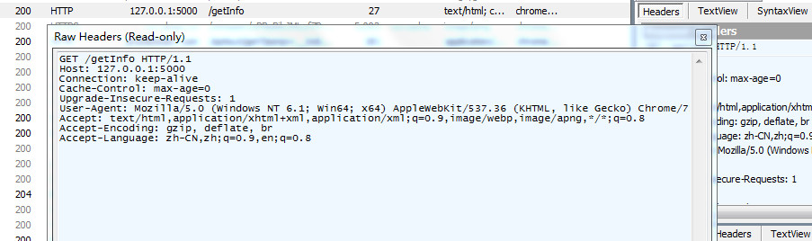

有了 Header 信息之后，就可以使用requests模块轻松获取，假装自己是浏览器了

```python
if __name__ == '__main__':

    headers = {
        'User-Agent': 'Mozilla/5.0 (Windows NT 6.1; Win64; x64) AppleWebKit/537.36 (KHTML, like Gecko) Chrome/72.0.3626.121 Safari/537.36'
    }

    url = 'http://127.0.0.1:5000/getInfo'
    response = requests.get(url,headers=headers)
    print(response.text)
```


#### 措施二：伪装ip地址

对于requests库

```
# 使用代理 ip 如下

proxie = { 
        'http' : 'http://xx.xxx.xxx.xxx:xxxx',
        'http' : 'http://xxx.xx.xx.xxx:xxx',
        ....
    }  
    
# 使用代理
response = requests.get(url,proxies=proxies)
```

网上免费的代理IP因为很多人用会很不稳定

市面上有人专门提供代理IP，直接去买就行了

不想去买就搞个IP代理池，主要就是通过 python 程序去抓取网上大量免费的代理 ip，然后定时的去检测这些 ip 可不可以用，那么下次你要使用代理 ip 的时候，你只需要去自己的 ip 代理池里面拿就行了。

开源 ip 代理池：https://github.com/Python3WebSpider/ProxyPool.git

首先使用 git clone 将源代码拉到你本地

```
git clone https://github.com/Python3WebSpider/ProxyPool.git
```

接着打开项目中的 setting.py，在这里可以配置相关信息

比如 Redis 的地址密码相关，

（如果你之前没有使用过 redis 的话，可以到如下地址下载https://github.com/MicrosoftArchive/redis/releases）

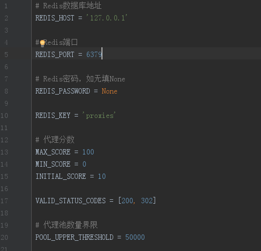

接着在你 clone 下来的文件目录中，安装相关所需的 python 模块

```
pip3 install -r requirements.txt
```

接下来开启你的 redis

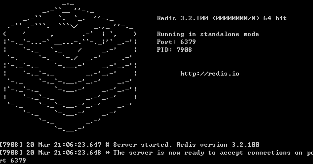

redis 的默认端口就是 6379，接着就可以运行 run.py 了

```python
代理池开始运行
 * Running on http://0.0.0.0:5555/ (Press CTRL+C to quit)
开始抓取代理
获取器开始执行
Crawling http://www.66ip.cn/1.html
正在抓取 http://www.66ip.cn/1.html
抓取成功 http://www.66ip.cn/1.html 200
成功获取到代理 201.69.7.108:9000
成功获取到代理 111.67.97.58:36251
成功获取到代理 187.32.159.61:51936
成功获取到代理 60.13.42.154:9999
成功获取到代理 106.14.5.129:80
成功获取到代理 222.92.112.66:8080
成功获取到代理 125.26.99.84:60493
...
```

如果你在运行的时候出现这个错误

AttributeError: 'int' object has no attribute 'items'

更新一下 redis 版本

```
pip3 install redis==2.10.6 
```

运行 run.py ，这时候在你的 redis 中就有爬取到的代理 ip 了

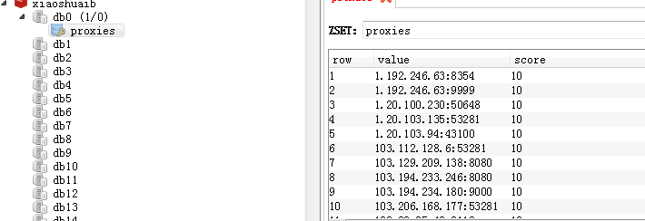

项目跑起来之后，你就可以访问你的代理池了，比如随机获取一个代理 ip 地址

```
http://localhost:5555/random
```

这样访问之后就会获取到一个代理 ip，在代码中获取代理也不在话下啦

```python
import requests

PROXY_POOL_URL = 'http://localhost:5555/random'

def get_proxy():
    try:
        response = requests.get(PROXY_POOL_URL)
        if response.status_code == 200:
            return response.text
    except ConnectionError:
        return None
```

这样，我们就成功的在我们的代理池中获取代理 ip 了，那么下次谁还敢封你ip，你就拿出你的代理ip，继续爬呗。


### 碰到需要登录的网站怎么办？

你好，由于你是游客，无法查看本文，请你登录再进，谢谢合作

当你在爬某些网站的时候，需要你登录才可以获取数据

登录的常见方法无非是这两种

1. 让你输入帐号和密码登录
2. 让你输入帐号密码+验证码登录


#### Cookie大法

每一个使用这个网站的人，服务器都会给他一个 Cookie，那么下次你再请求数据的时候，你顺带把这个 Cookie 传过去，服务器会判断为有登录过，直接返回数据给他吧。

在服务中还可以设置 Cookie 的有效时间，携带一个过期了的 Cookie 给服务器的时候，服务器还是需要你重新再登录一次，然后再给你一个有效的 Cookie

Cookie 的时长周期是服务器那边定的

在Chrome的F12的network标签，可以看到请求头有你的Cookie

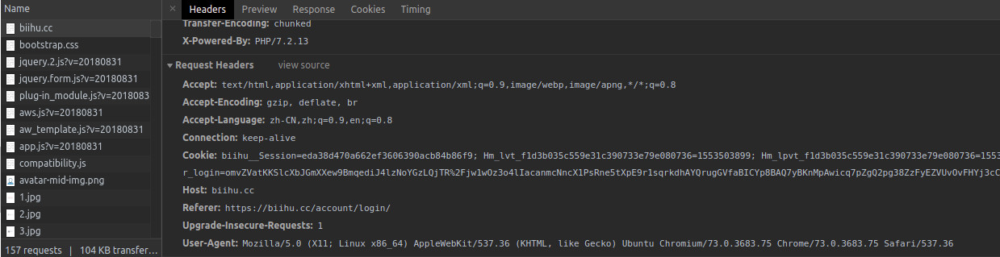

有了 Cookie 之后，我们在代码中直接获取我的个人信息

```python
import requests

headers = {
    # 假装自己是浏览器
    'User-Agent': 'Mozilla/5.0 (X11; Linux x86_64) AppleWebKit/537.36 (KHTML, like Gecko) Ubuntu Chromium/73.0.3683.75 Chrome/73.0.3683.75 Safari/537.36',
    # 把你刚刚拿到的Cookie塞进来
    'Cookie': 'eda38d470a662ef3606390ac3b84b86f9; Hm_lvt_f1d3b035c559e31c390733e79e080736=1553503899; biihu__user_login=omvZVatKKSlcXbJGmXXew9BmqediJ4lzNoYGzLQjTR%2Fjw1wOz3o4lIacanmcNncX1PsRne5tXpE9r1sqrkdhAYQrugGVfaBICYp8BAQ7yBKnMpAwicq7pZgQ2pg38ZzFyEZVUvOvFHYj3cChZFEWqQ%3D%3D; Hm_lpvt_f1d3b035c559e31c390733e79e080736=1553505597',
}

session = requests.Session()
response = session.get('https://biihu.cc/people/wistbean%E7%9C%9F%E7%89%B9%E4%B9%88%E5%B8%85', headers=headers)

print(response.text)
```

运行后可以发现不用登录就可以直接拿到自己的个人信息了


#### 表单请求大法

通过抓包，获取请求登录的时候需要用到的用户名密码参数，然后以表单的形式请求服务器


#### Selenium 自动登录法

Selenium 自动登录也太 tm 简单了吧，获取到两个输入框的元素，再获取到登录按钮

往输入框写你的帐号密码，然后自动点击一下登录

```python
username = WAIT.until(EC.presence_of_element_located((By.CSS_SELECTOR, "帐号的selector")))
password = WAIT.until(EC.presence_of_element_located((By.CSS_SELECTOR, "密码的selector")))
submit = WAIT.until(EC.element_to_be_clickable((By.XPATH, '按钮的xpath')))

username.send_keys('你的帐号')
password.send_keys('你的密码')
submit.click()
```

登录完之后拿到 Cookie

```python
cookies = webdriver.get_cookies()
```


#### 图形验证码的解决方案


用 python 强大的 OCR 工具：Python-tesseract

```
pip install pytesseract
sudo apt install tesseract-ocr
```

```python
try:
    from PIL import Image
except ImportError:
    import Image
import pytesseract
```

```python
captcha = Image.open("captcha1.png")
result = pytesseract.image_to_string(captcha)
print(result)
```

pytesseract 是没办法识别太多噪点的图片的，所以我们先对图片灰度处理一下，并对其 二值化

```python
captcha = Image.open("captcha2.png")

def convert_img(img,threshold):
    img = img.convert("L")  # 处理灰度
    pixels = img.load()
    for x in range(img.width):
        for y in range(img.height):
            if pixels[x, y] > threshold:
                pixels[x, y] = 255
            else:
                pixels[x, y] = 0
    return img

convert_img(captcha,150)

# 识别一下
result = pytesseract.image_to_string(result)
print(result)
```

还可以做降噪处理

```python
data = img.getdata()
w,h = img.size
count = 0
for x in range(1,h-1):
    for y in range(1, h - 1):
        # 找出各个像素方向
        mid_pixel = data[w * y + x]
        if mid_pixel == 0:
            top_pixel = data[w * (y - 1) + x]
            left_pixel = data[w * y + (x - 1)]
            down_pixel = data[w * (y + 1) + x]
            right_pixel = data[w * y + (x + 1)]

            if top_pixel == 0:
                count += 1
            if left_pixel == 0:
                count += 1
            if down_pixel == 0:
                count += 1
            if right_pixel == 0:
                count += 1
            if count > 4:
                img.putpixel((x, y), 0)
```


市面上还有许多打码验证平台，花点钱买个接口，直接调用就行

自己能学着搞定为啥要花钱，除非真的是识别率低到叫爸爸，当然如果是公司项目就另当别论了

模拟登陆的好的开源项目

https://github.com/CriseLYJ/awesome-python-login-model

登录完拿到 cookie，然后做你想做的事情，这个项目现在实现了这些网站的模拟登录

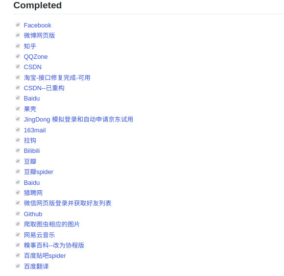