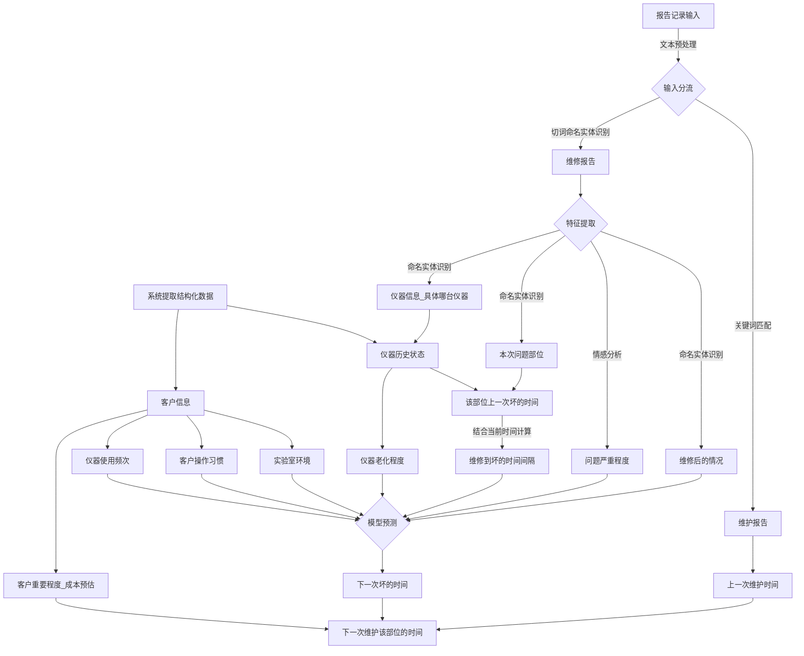
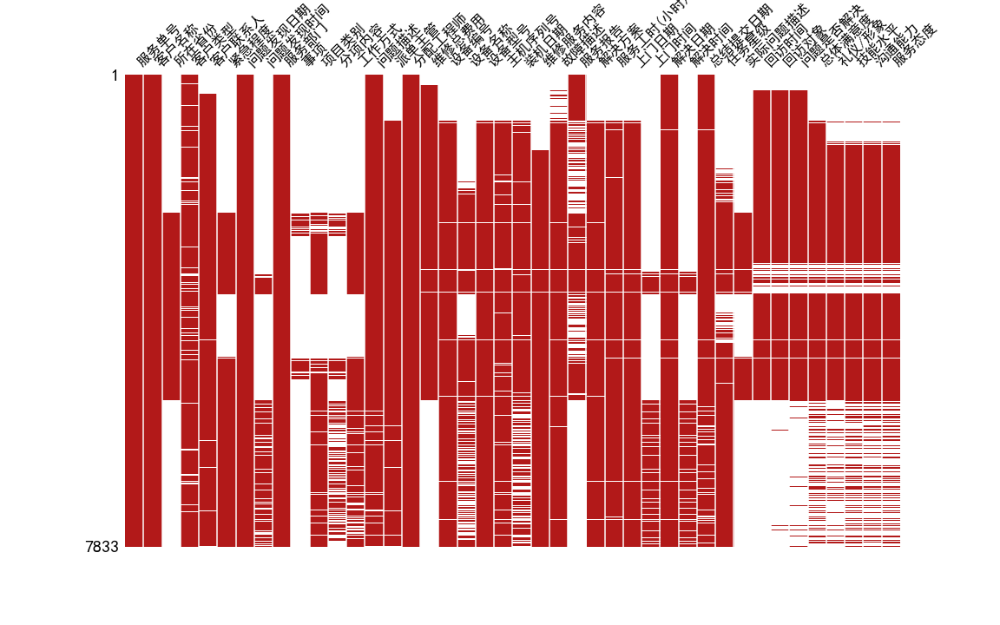
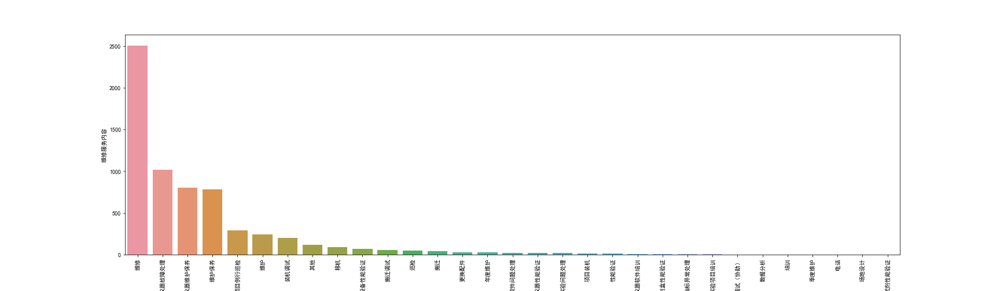
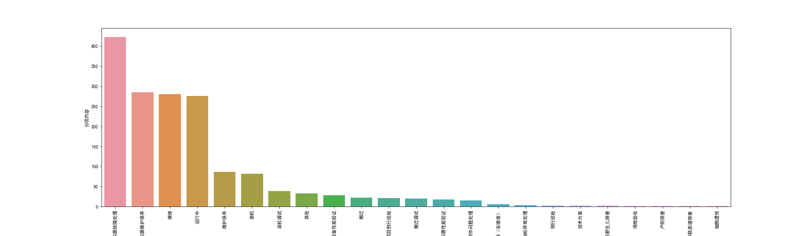
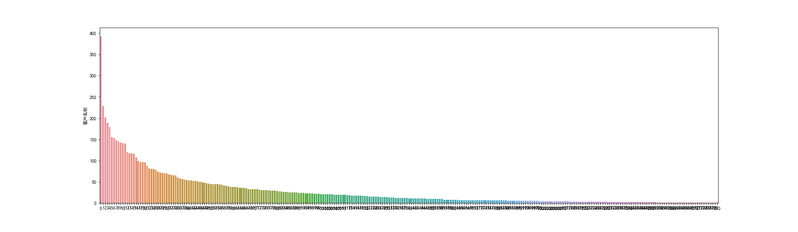

## Biosan维修部维护效率提升项目


### 项目目标

利用Biosan技术保障中心维修部的历史维修报告记录文本，提取出各种设备的历史故障数据（包括使用年限、维修服务内容、故障描述、故障模块、故障时间等，部分设备的实验数据（例如质谱仪等）），建立一套运维模式，预测仪器发生故障的风险，对风险较高的设备进行干预（重点巡检和维护）。


### 问题分析

需要回答的问题是，下次对某台仪器需要什么时候去维护

所以预测的主体，应该是仪器而不是客户

其次，存在一次维护修复多台仪器的可能，所以训练样本的条数并不是数据的行数，需要对所有数据进行拆分，对每条仪器的护理动作单独提出来才行


最简单的思路：

定义每一家客户，每一台仪器，每一个核心部件（模块）的目前情况[《1235模块关键词定义》](source/md/1235关键词按模块分类.md)

定义这一核心部件一般在多长时间会坏，预测下一次坏的时间

仪器维护的时间是所有核心部件的维护加权合。


根据这一分析思路，认为目前的数据需要提取的信息包括：

1. 每个客户分别有哪些仪器，每台仪器的装机时间和维修次数，维修的内容需要细分，每个部位分别经过了多少次维修，目前情况如何评价
2. 需要定义每一类型仪器在某个部位坏了之后的寿命，或者某个部位某次维修之后，下次报错可能需要的时间。这个时间的定义可以是实验批次即老师操作的次数，也有可能是样本量。如果是样本量，需要读取每个客户的单批次实验样本量和总年度样本量，就跟汽车的里程一样计算寿命。
3. 如何细分大问题和小问题，可能一句话里既包括大问题又包括小问题，问题的分类需要和工程师沟通。


存在的数据偏差：

1. 不同工程师的报告风格不同，这与对应带教师父的要求严格程度有关，比如质谱工程师的记录就要比其他人的记录要相对详细，可能会带入更多问题。
2. 2015年的部分数据存在明显的缺失，可能是系统导出的不完整，是否可以直接丢弃这部分样本，值得考究。


通过观察 **问题描述** 及 **服务报告**内容，可以看到：

1. 问题中存在定期维护的内容，存在修理一台仪器同时维护另一台仪器的情况，需要观察定期维护的内容和其他有什么区别。

   这部分信息在**服务部门**字段有提及一部分，但并不全

2. 问题描述的部分是解释这次维修服务去解决的问题，服务报告是具体解决问题的方法。

3. 部分问题描述被记录在服务报告里，考虑是否应该把这两列合并处理

4. 服务报告的末尾一般有本次服务的结论，是否修好，可以选择提取一部分然后做人工的修正得出维修结果

   在另一列**问题是否解决**含有一部分此类结论，但是存在大部分的缺失

5. 存在一列**故障描述**包含了部分问题描述的内容


有一个核心问题是，如何衡量这次维护所修复的问题大小

1. 可以参考维修总费用这一列，存在一部分的缺失但是大部分是0。如何定义高额维修费用之后仪器的状态也是一个关键点。并且存在一次维护对多台仪器维护的可能，在拆分样本的时候如何对这一数据进行拆分，也是关键所在

2. 根据工程师提供的问题定义划分


### 目标设定


如果将维修后的下一次维修时间作为预测目标：





### 数据预处理

3表合并之后，总数据量为7833条


#### 数据缺失情况



#### 结构化数据

数据共有44列，包括

1. 单号信息：服务单号，紧急程度， 服务部门，事项，项目类别， 分项内容，工作方式， 派单主管，分配工程师，维修总费用，维修服务内容，任务星级， 问题是否解决，总体满意度， 礼仪/形象， 技能水平， 沟通能力， 服务态度 

2. 客户信息：客户名称，所在省份， 客户类型， 客户联系人，回访对象

3. 日期时间信息：问题发现日期， 问题发现时间，装机日期，服务工时(小时)，上门日期， 上门时间， 解决日期， 解决时间，总结提交日期，回访时间

4. 设备型号：设备编号， 设备名称， 设备型号， 主机序列号 
5. 文本信息：问题描述， 故障描述，服务报告，解决方案，实际问题描述


##### 单号信息

重要的信息包括：紧急程度，分项内容，维修服务内容，问题是否解决

其中存在大量的缺失和乱填的情况。

1. 紧急程度缺失较多，一部分可以用来衡量这次故障的严重性，但受一部分客户重要程度的偏差影响？

2. 维修服务内容可以帮助我们找到是定期维护还是维修还是其他目的的报告：



3. 分项内容的功能和维修服务内容有一部分重合：



4. 问题是否解决可以默认是已经解决的，如果存在重复维修可以标记为未解决


##### 客户信息



有客户信息表可以看出，近一半客户的维修次数都在10以下，很多是区域外的客户或者是新开展的客户，但其实所有的仪器都需要维护，不管客户分级。

客户信息主要帮助我们补全仪器对应的信息和作为插补其他指标的辅助特征。

所以客户信息并不必要，只需要**设备编号**这个唯一码就可以定义同一台仪器的所有记录。


##### 设备信息

数据对应的设备特征有

1. 设备编号：每台仪器的唯一号
2. 设备名称：仪器的名称，属于大类。类似iphone与小米
3. 设备型号：仪器的型号，同一大类仪器有多种型号，如1235有1235-514，1235-5220， 1235-501，1235-0110四个型号。类似iphone-7与iphone-X

经统计发现设备编号、型号、名称都有大部分的缺失出现，需要补全完整。

当然也可以先不补全，先使用信息完全的样本做训练，如果模型效果不好，信息量不够，再补全这部分，装机时间就按照对应设备编号第一次维修的时间来安排即可。

去除设备编号空缺的样本，剩余6917例

4. 主机序列号：与设备编号对应，设备编号是Biosan自己的编号，主机序列号是该设备的全球编号或者说生产公司的编号


##### 日期时间信息

1. 问题发现日期：关键特征，记录本单问题发现的日期
2. 问题发现时间：过细的特征，没有太大的影响
3. 装机日期：对应设备装机的时间，可以用来计算仪器的使用寿命，每台仪器有一个装机日期，对应设备编号，可以建立一张表格用来查找。
4. 服务小时：可以间接反映问题的难以解决的程度，是个定量指标，记录相对较全。但有随意登记的可能性，需要核实每一个的准确性。
5. 上门日期：与问题发现日期对应
6. 上门时间：过细的特征，没有太大的影响
7. 解决日期，解决时间：与服务小时重叠，可以用来衡量服务小时是否准确
8. 总结提交日期，回访时间：没有太大的影响


##### 文本信息

信息最多的NLP部分


包括五部分：问题描述， 故障描述，服务报告，解决方案，实际问题描述

由于不同工程师的报告书写习惯不同，或者不同带教师父的要求不同，导致每个工程师的空缺部分是不同的，可以研究每个人的模式来分开处理，将五条栏目合并成 问题——解决方案 两列即可。


###### 问题描述

问题描述包括工程师对问题的描述，或者实验室老师对问题描述两种可能性

存在描述是一种问题，但实际是另一种问题的可能性

```
1235仪器偶尔提示TipInAir。
偶尔17-OHP实验提示TipInAir4331
Lis与Leica软件对接问题。
FISH扫描对焦失败。
双标实验F点偏高，400万以上；筛查阳性率低于平时，只有2%-3%；
GSL120黑屏重启，显卡温度高。GSL120年度保养。
1、加样针误报clot，不多，每次实验一两个，但客户不接受；2、洗板机头容易堵（我今天过去检查）
1235产筛实验结果，标准品第四点异常，diff偏差超过50%。
GSP性能检测。
近期第二次发生找不到增强液的报错已安排杨露鉴去检查
1235产筛实验，标准品D点偏低，同时，质控中值也偏低，样本中，只要是4号针加样的样本，都有偏低的倾向，因此需要检查加样针的加样精度。（已安排潘盛过去）
1、洗板机堵孔，昨日多次清洁后正常，今天又堵，清洁无效2、最近两次实验高值质控低出控，第一次原因不明，第二次确认为质控复融问题，科室希望做仪器维护排除仪器问题（1个月前已做年度维护，后更换滤光片和导轨）
杭州市妇产科医院2号1235仪器，联机报错，1号针注射器工作异常
客户反映GSL120加油针不灵活；1235做性能验证，并出具报告；
1.新筛实验有报bloodmissing的报错2.170hp实验缓冲液位置报错tipinair3.实验结果出控，复孔标准品的差异很大.客户希望进行相关性能测试
1235实验过程中突然在去血片过程中出现真空错误，疑似发生严重漏气
近期加样枪两次问题，一次去吸头时的up-downmoversteppingerror，一次去黑帽时的up-downmoversteppingerror，并且提示取不到黑帽；还有长期以来的真空错误
MB8扫描对焦模糊；初步判断为显微镜Z轴磨损，待下周二与奥林帕斯售后仪器上门维修。
KM2明场捕获图像质量不理想，要求调试参数；3台KM系统维护保养；
客户反映最近阳性标本复查重复性下降，cv超过10%的标本增多。需要仪器保养与性能验证。
早孕实验报错“foamdetected”，导致不吸样，加样针涂层损坏严重，需要更换
1235联机报错epprom读取错误，怀疑node1IC14故障需要更换
确认空气过滤器需要更换，销售已报价。
维修洗板机堵，并执行年度维护；
例行执行半年度维护
1235 更换电脑 系统重装软件重装
执行1235半年度维护
执行1235季度维护
```


###### 故障描述

```
K和H装机以来，一直偶发性报server Busy错误，两台质谱的工作站均为联想C30
K和H装机以来，一直偶发性报server Busy错误，两台质谱的工作站均为联想C30
客户反映，仪器联机时载物台不动，并且报failed to home system错误 
1、洗板机面板故障2、1420需要维护
1、最近一次新筛实验中，1235板处理器仪器无故报液体满。 2、历史记录中有较多真空错误报错 3、执行维护
1235仪器打枪头报错戳到底部废枪头
	客户反应1235温控风扇不工作，内部温度报警
客户反映120开机，显微镜前小液晶屏不亮，仪器无法初始化。据客户描述，显微镜控制盒开关开启时，听到内部有异响，怀疑显微镜控制盒内主板电源板损坏。
振荡孵育器工作噪音大，需检查原因
 * 右枪通过白帽去检查吸头和稀释杯的时候，会误报missing，需要重试多次才能通过；  * 现场发现振荡孵育器工作噪音较大；  * 现场检查发现试剂仓滑块弹簧和卡簧掉落，其中弹簧遗失，T型头可自由活动； 
120仪器能扫描，但不能拍照
维护保养
1、客户反映，近期旧仪器实验质控不好，有多次出控现象。 2、客户反映近期ups红灯亮起，并且停电时未起到备用电源的作用。 
客户反映120油路有严重的漏油现象
客户反应实验中有些样本结果特别低，重新复查后结果恢复正常；
1235检测所有最后一块UE3的中高质控值低出控，超出3SD
洗涤工作站1号和4号模块有漏液
维护保养
最近一次早孕实验稀释过程中有较多未探测到液体和探测到气泡的报错
故障：	* 仪器做PKU实验时候报卤素灯滤光轮错误；
```


###### 服务报告

```
1、校准右枪Flag传感器位置；2、对换左右枪；3、待观察
1、校准右枪TipSensor压力；2、移除空气过滤器，真空报错正常；3、待观察；
leica软件生成xml文件，包含病人信息及图像信息；Lis直接调用xml文件内容，实现对接；
1、测试发现客户未调试好曝光时间；2、培训客户调试曝光时间，测试扫描正常；
检查仪器Flash值为1380，反馈滤光片腐蚀；用增强液及无水酒精清洁反馈滤光片；Flash下降至1180；用Eu定标液重新校准FLASH值至1080；测试实验双标F点降低至330万，恢复正常；
问题：GSL120黑屏，怀疑显卡故障，年度维护处理：到场后，客户已更换显卡，电脑能正常工作。根据客户反应，最近一次有一张玻片拍到空白照片。检查后发现仪器光源不稳定，摄像头画面明暗闪烁。询问得知客户最近自行跟换灯泡，检查灯泡发现瓦数不对，正常使用100w的灯泡，客户换上去的是30w换100w灯泡后光源稳定仪器全套校准结果：隔夜扫片正常。
检查确认仪器大概率不存在问题，首先每次实验报clot的数量减少，只有一两个，其次是报错并不集中于某一根针，3次报错分别是三根不同的加样针。进行的操作是检查了加样针的固定和排线的链接，重新校准了液面感应。并对样本上机前处理，同许主任进行了交流。针对浙江等地的经验，即上机前用竹签再挑一下，许主任暂时是抵触的，需要俞勇再去教育一下。客户反应的另一个洗板机头容易堵的情况，检查下来没有发现什么异常，清洁了洗板机头。
对四根加样针进行精度测试：P1=25.33，P2=25.17，P3=25.12，P4=25.23，正常；进行洗板测试，发现部分孔注水不满，吸的时候对应的单数列第四个点吸的水吸不干，残留三分之一左右；实验标准曲线不好是由于洗板机头问题，清洁洗板机头，并指导客户如何清洁；
-washertest正常-MeasurementModuleTest正常-HighVolumePipetteTest正常-LowVolumePipetteTest正常
问题：开机自检报错，机器无法运行；措施：1.查看历史记录，发现实验前未放置稀释杯，导致实验无法往下走2.维护增强液管路，对管路进行疏通，未发现异物结果：1.增强液测试通过；2.开机自检正常；3.跟一次实验正常；
对四根加样针进行精度测试，发现第四根针在加水之后针尖挂水滴；把第四根针与第三根互换，发现第三根（原来的第四根针）挂水滴，说明是针的问题；由于另外三根针也有锈迹，更换一套4根针，精度测试P1=25.10，P2=25.02，P3=24.90，P4=24.81，符合范围；查看历史记录，发现去血片时候有报真空错误，最近一次实验每块板子报两个；查看真空泵，发现2号真空泵停止工作，把2号与3号对换，发现3号（原来的2号）依然停止工作；与主任沟通后更换停止工作的3号真空泵，与空气过滤器（过滤器原来的坏了，吴挺拆下来之后仪器未安装过滤器，现在安装一个新的）；
嘉兴妇保洗板头反复堵塞，清洁洗板头、电磁阀，测试正常。右枪加样准确度测试正常，定标液测试正常。仪器状态正常。
更换2号注射器泵，Rinse测试正常；2板实验正常；
清洁120加油针，调试加油针角度，校准坐标；恢复正常；
1235右枪加样时会有试剂滴出，右枪有磨损。右枪压力调整，测试正常，建议更换。洗板测试、加增强液测试、去血片测试、定标液测试正常。
问题：仪器第五板去血片报5个真空错误，第六板去血片报10个真空错误，导致操作超时，流程停止；措施:报真空错误怀疑1.系统漏气2.抽负压效率低；真空泵工作间隔大于2min，排除系统漏气；抽负压效率低原因：1.泵工作效率低，如停止工作2.气路堵塞；连续做了8板去血片测试后，泵依旧工作；最后怀疑气路堵塞，拆掉过滤器后，仪器正常；总结：气路堵塞的情况，真空泵的出气量可以感觉到比较小，抽真空的时间会比较长；
聊城市妇幼保健院问题：1235右枪近期两次up-downmoveerror处理：查看历史记录，最近一次报错是在打枪头时出现，是由打枪头时戳到托盘上的废枪头引起前一次报错是由于打枪头时未正常将枪头打掉，导致配试剂过程中，取防蒸发帽过程错误。测试右枪气压和机械步进误差均正常，配试剂测试均正常。清洁右枪枪头，检查右枪坐标均正常。试剂仓步进误差正常针对历史记录中的真空错误较多问题，清洁去血片头，调紧去血片头的压轮。去血片测试气压正常。跟踪一次实验未出现异常。结果：可正常使用。
将扫描主机移到地面上，画面晃动减弱，图像捕获清晰；
问题：捕获时条带不清晰，保养3台显微镜。处理：1，清洁各镜头，平台，科勒照明调整。2，捕获，比原先市时清晰。3，设置快捷键。结果：仪器使用正常。
富阳区妇幼保健院：1235年度维护：1.机械测试正常；增强液加样精度正常；洗板机残余量正常；加样枪测试正常；2.检测单元正常，Eu：103.9万，Sm：10.5万，flash：1212.3.加样针精度测试正常4.填写校验报告。仪器性能正常，对于之前出现一次阳性标本复查正常情况，可能为其他原因导致。
```


###### 解决方案

```
1.陈险峰到实验室后检查发现2777所有firmware为2.4.0，故根据文件要求更新到2.6.2，并且重新调整2777 objects的位置2.电脑更换为P510，安装MassLynx SCN918，出现could not delete DHCP service，质谱无法建立通讯，DHCP server打不开，重装MassLynx后恢复正常，安装Waters Pump Control 1.12.12183.复溶测试4块板，正常4.MS Consle 打不开，应为昨天卸载安装waters pump control导致，重装MassLynx及pump control，进行PEG的Intellistart调谐，完成后检查发现MS Scan的校正曲线将45.03的质量数认错，重新修改校正曲线后正常5.之后上机测试正常
1.电脑更换为P510，安装MassLynx SCN849，出现could not delete DHCP Service，多次重启安装849，均报此错误，质谱无法建立通讯2.卸载849，安装918（要求重新安装C++），无报错，再次卸载918，再次安装849（又再次要求重新安装C++，此次忽略），无报错，质谱建立通讯3.进行Intellistart，建立液相和2777的连接，并测试复溶板，正常
到现场后插拔载物台插座，重启电脑与仪器，SLtest connect正常，但执行home命令任然报错。 由于connect正常，能确保电脑与仪器的通讯正常，基本可以排除电脑与仪器接口等问题。 根据经验，仪器载物台在超越极限位置时，home命令有时会失效。在关机状态下将载物台x，y方向推至中间位置，home测试任然报错。 关机状态下将升降梯推至中间位置，home测试正常。 怀疑仪器上次关机时，片盒在上方，断电后导致自由下坠， 行程超极限位。 扫片测试正常。 结果： 隔夜扫片未见异常。
1、更换洗板机按键面板。 2、1420常规维护。
1、检查废液桶盖，发现桶盖两液面探针底部密封的白胶已脱落，当废液飞溅到盖上时，容易导致探针导通，导致误报。 更换废液桶盖。 2、检查真空泵的工作情况，发现中间2号泵停止工作。 打开后盖，检查2号泵碳刷，对比其它泵的碳刷发现磨损差不多，清洁真空泵。 检查所有真空泵电源接口，发现接口都比较松，夹紧电源接口。 装回真空泵均工作正常，暂时无需更换。 3、执行仪器维护。
改造废物托盘，在打枪头的橡皮垫上加一圈橡胶圈
1. 重新安装软件；2. NODE板清灰，重新插拔接口，重启后问题解决；
检查主板电源板，板面有两处贴片电阻烧坏痕迹。 断开限流板对次级电路的供电线，测量限流板输出，输出电压为220v正常电压。 检查灯板电源板，未见烧坏迹象，根据故障现象，可以排除灯板电源板故障。 检查主板，未见异常。 检查保险丝，未见异常。 更换主板电源板，开机自检正常。 扫片测试正常。
确认该问题无法维修，建议更换整个振荡孵育模块
 * 拆下振荡孵育器，清洁并润滑每个轴承；  * 手动转动，仍然可感觉到不顺畅；  * 重新安装传动齿轮和皮带后，发现不顺畅感消失，快速转动无异响；  * 重新安装振荡孵育器后测试恢复正常；  * 校准加样枪压力，未发现显著差异；  * 试剂仓滑块组件寄到，更换了遗失的弹簧和怀疑会太松的卡簧；  * 校准加样枪坐标，测试加样枪工作正常； 
```


###### 实际问题描述

实际问题描述为工程师在解决问题过程中发现的问题，相比比问题描述的更准确

但是实际问题描述存在大量的缺失，可能与问题描述重复，大部分工程师并不做这部分工作

考虑可以与问题描述列合并，但是需要解决语义重复等问题

```
K和H装机以来，一直偶发性报serverBusy错误，两台质谱的工作站均为联想C30
K和H装机以来，一直偶发性报serverBusy错误，两台质谱的工作站均为联想C30
1.M52电脑，更换MassLynx版本为SCN8492.与质谱ping连接，发现原网卡故障，更换原C30网卡，建立质谱通讯3.配制Masslynx，上机测试发现响应只有600-700，无TIC图形，测试其他新筛板依旧如此4.怀疑电脑软件问题，网卡和GPIB卡装回到C30，联机重置质谱后，上机测试发现问题依旧5.清洗锥孔，并进PEG发现无任何特征峰出现，同时检查诊断界面，发现MS1RFGenerator振荡电压无法上升6.泄真空，重新插拔MS1RFGenerator相关线路，开机抽真空后，加压后问题依旧7.换回C30，并质谱断电重启，按此操作后问题依旧，基本断定为MS1RFGenerator故障；下礼拜一需报修Waters订购配件
1.操作系统及MassLynx及相关驱动安装好2.将WaterPumpControl更换为1.12.1218后，发现MSConsole打不开报错3.重装MassLynx解决，建立连接，复溶5块板测试，次日周一无报错；后续进行测试
图像重复（同一核型拍两次）拍出来白色图像更换灯泡
QuattroMicro仪器，今年6月份清洗过离子源后响应尚可，近期仪器响应不稳定，工程师上门维护一下，响应即能恢复，但实验人员平时维护后，响应又复下降，反复几次，怀疑仪器依然存在问题
机械泵漏油严重
加样针在板和洗针槽的位置偏；
120拍出来的核型总是往上偏
1235增强液黑色罩子掉落
```

