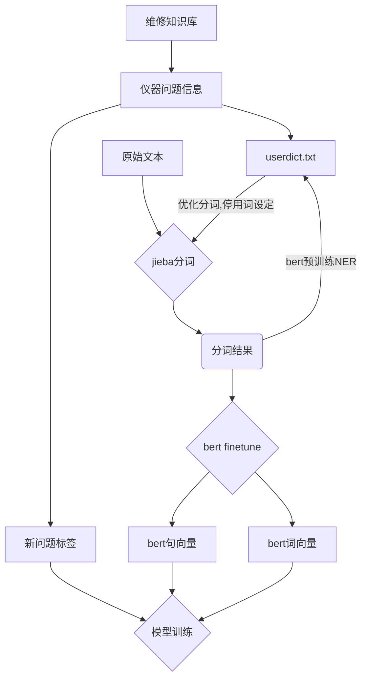
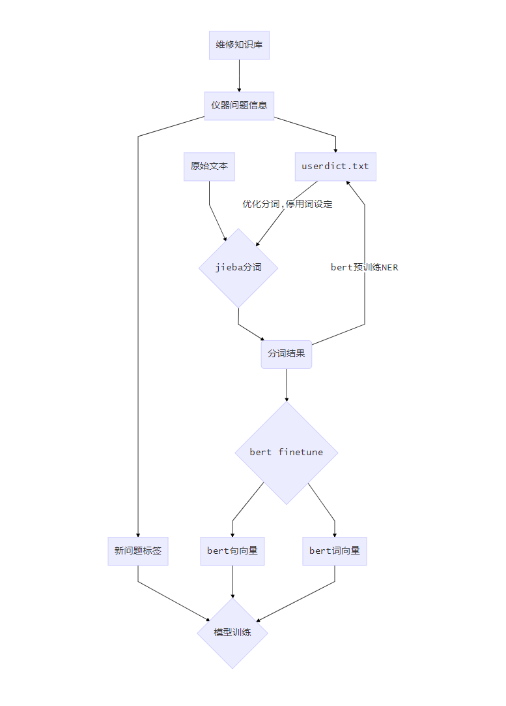

## NLP部分


### 问题分析

```
'K和H装机以来，一直偶发性报serverBusy错误，两台质谱的工作站均为联想C30K和H装机以来，一直偶发性报serverBusy错误，两台质谱的工作站均为联想C30客户反映，仪器联机时载物台不动，并且报failedtohomesystem错误1、洗板机面板需要更换2、1420需要维护1、最近一次新筛实验中，1235板处理器仪器无故报液体满。2、历史记录中有较多真空错误报错3、执行维护右枪打枪头过程中报up-downmoversteppingerror，应该是戳到了托盘里的枪头，尝试通过改造托盘，从根本上解决该问题1235仪器打枪头报错戳到底部废枪头客户反应1235温控风扇不工作，内部温度报警，需检查客户反映120开机，显微镜前小液晶屏不亮客户反映120开机，显微镜前小液晶屏不亮，仪器无法初始化。据客户描述，显微镜控制盒开关开启时，听到内部有异响，怀疑显微镜控制盒内主板电源板损坏。振荡孵育器工作噪音大，需检查原因1、右枪探测吸头和稀释杯异常2、振荡孵育器工作噪音大3、试剂仓滑块损坏*右枪通过白帽去检查吸头和稀释杯的时候，会误报missing，需要重试多次才能通过；*现场发现振荡孵育器工作噪音较大；*现场检查发现试剂仓滑块弹簧和卡簧掉落，其中弹簧遗失，T型头可自由活动；'
```


问题描述和解决方案是这部分数据集信息最多的部分，需要做NLP的工作为最终的预测提取有用信息。

通过观察认为，对应的文本具有以下几个特质：

1. 由于是不同工程师撰写的报告文档，每个人撰写报告的特性不一样，有的文本非常简洁，内容只是概要，可能漏掉了一些有用的信息没有记录。而有些人由于领导要求，写的相对繁杂。所以有长文本和短文本的区别，最长的文本有1989个字，而最短的只有2个字。平均字数为123。对应的各工程师的字符长度如下：

| 分配工程师 | text_len |
| ---------: | -------: |
|     傅菲菲 |    293.5 |
|     刘文久 |    150.0 |
|       吴挺 |     91.0 |
|       宋挺 |    200.0 |
|       康迈 |    122.0 |
|     徐琪枫 |    113.0 |
|     徐睿超 |     94.0 |
|     戴明路 |    129.5 |
|     文立强 |    138.0 |
|     杨露鉴 |     94.5 |
|       林栋 |    122.5 |
|     林正一 |    109.0 |
|     林玉军 |     60.0 |
|     梅志强 |    161.5 |
|       潘盛 |    114.5 |
|       王剑 |    122.0 |
|      王强2 |    123.0 |
|     王新震 |    144.0 |
|       祁鼎 |    140.0 |
|     肖无双 |    148.0 |
|     赵佳盛 |    203.0 |
|       车鑫 |    263.0 |
|     邱俊杰 |     80.0 |
|     郑耀庭 |     77.0 |
|     钟晨捷 |    192.0 |
|     陈凌云 |    147.0 |
|       马驰 |    138.0 |
|     黄玉立 |     67.0 |

2. 对于字数过少的样本，可能需要当做缺失来处理，对于模型训练，意义可能不大，需要单独拿出来观察样本的情况。对于特别冗长的文章，其中也必然有我们需要的信息，如何使用有效的方法提取出对我们有用的信息，是解决这个问题的关键。

   举例如

   ```
   GSP季度维护，客户反映PKU近期检测值偏低；1235季度维护，近期质控偶尔有出控情况；
   ```

   有用的信息为，GSP，季度维护，PKU，检测值偏低，1235，季度维护，质控，出控

   而其他的文字，提供了我们不需要的信息，在算法取窗宽的时候，可能干扰我们的结论，也会使得维度过高或者文本过长，通过提取关键字的方法，将一些我们不需要的文字停用，在保证信息不损失太多的情况下缩短文本，是一个解决的思路。

   这可能要涉及一部分NER的工作。

3. 在缩短文本的过程中，需要调用jieba的标准库，针对问题需要建立一部分userdict，对于不合理的分词进行调整，同时增加一部分停用词，使得最终的分词结果是对我们最优的。

4. 在分词完毕预处理完文本后，需要做文本表示，将对应的文本打成词向量和句向量作为训练。

5. 首先，尝试使用了Word2Vec + lightgbm 的方法，对于紧急情况一列建立了一个分类模型来测试样本的干净程度，由于训练样本过少只有6904例，很明显可以看到在不使用预训练的情况下，模型有很明显的过拟合倾向。对应的训练标签如下设计：

   | 紧急程度 | 样本量 | 标签设计 |
   | -------: | -----: | -------: |
   |     未知 |   3577 |   测试集 |
   |     正常 |   1529 |    标签0 |
   |     紧急 |    836 |    标签1 |
   |   无要求 |    580 |    标签0 |
   |     重要 |    382 |    标签1 |

   对于相同的样本，不使用bert的预训练来建立BiLSTM对模型进行分类，auc达到0.91，而在使用bert中文预训练模型的基础上，auc只有0.68，可见在小样本上不使用预训练是有很高的过拟合可能性的。

   主要的影响来源于标签的错误，由于每条记录的标签是由不同的工程师打的，没有统一的规范，有人习惯所有问题都打紧急，有人按时间打，有人按客户重要性打，有人所有的都习惯填写正常，所以标签的可用性是极低的。为了体现问题的重要程度需要采取别的方案。

   目前可以想到的方案包括：

   - 有监督的方案：通过维修部故障知识数据库，调取各仪器的故障明细，将故障分类，通过正则给各样本打上标签，用于模型训练。
   - 无监督的方案：通过句向量和词向量结合的方案，将所有文本进行聚类分析，挑出其中明显可以分出类的样本和模糊的样本。建立标签转为半监督或者有监督的方案。

   这类方法明显的问题是，存在一条记录里又有对某些仪器的年度维护，又对其他仪器维修的记录，所以信息是冗余和复杂的。也有工程师将不同操作的报告分成多条，但是文本的内容是一样的，很难单独抓出来其中单一仪器的情况。


### 实施方案

针对之前的分析，初步拟定实施方案如下：





