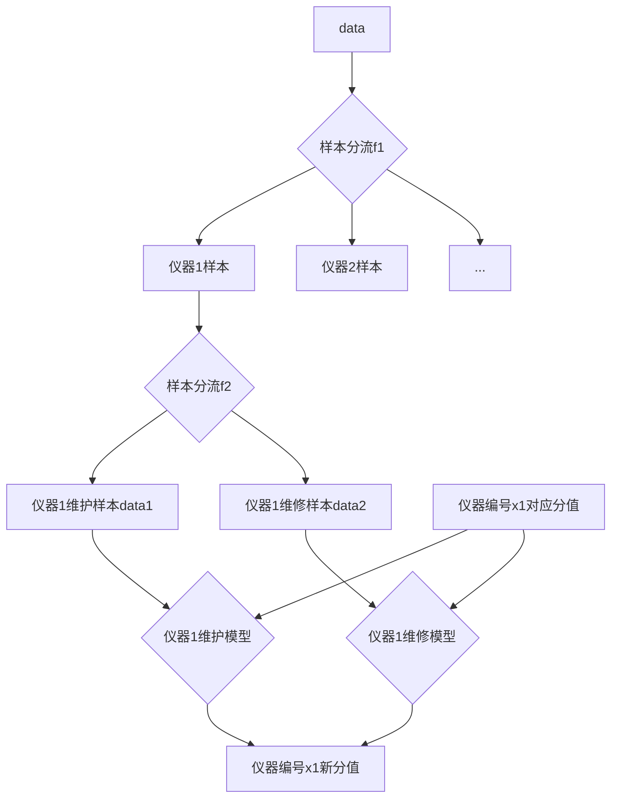
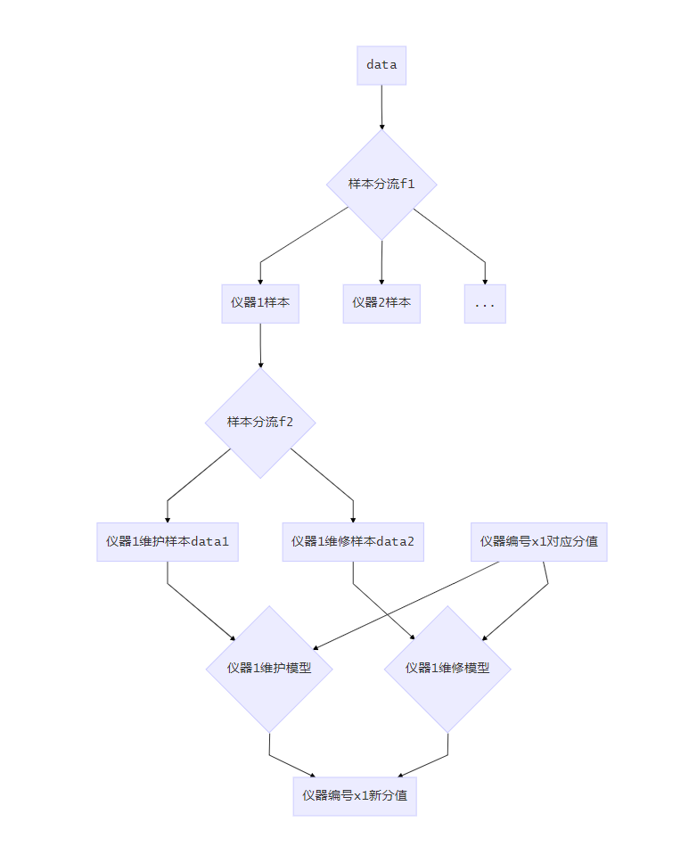
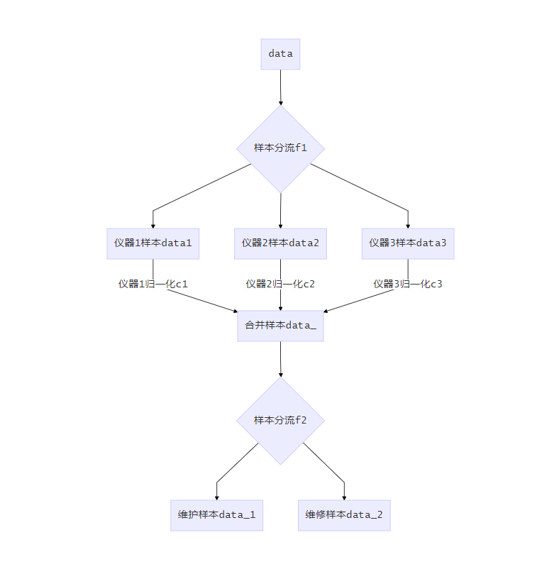
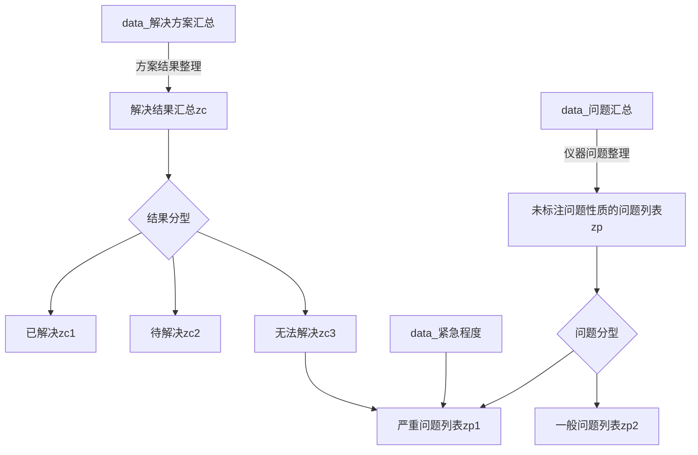
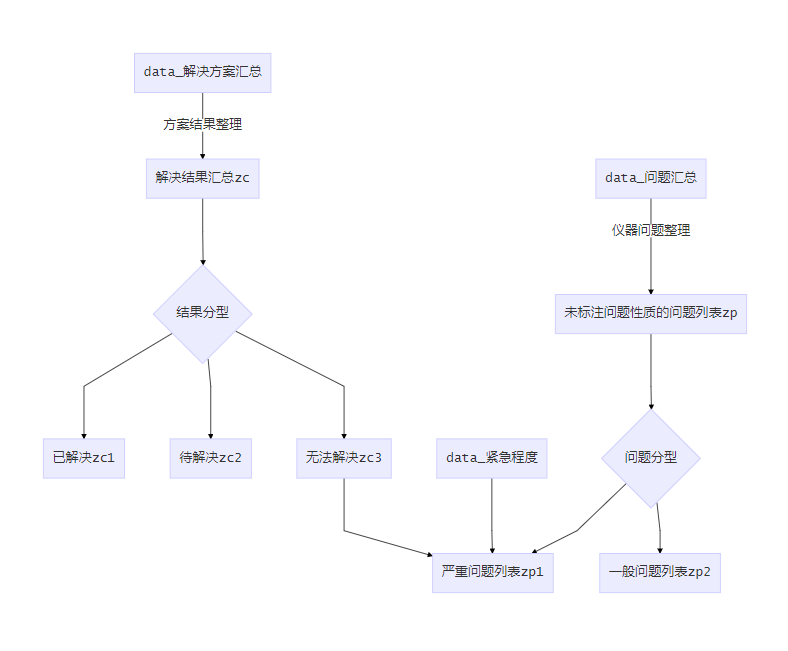

## 特征工程设计


### 样本分类流程

绘出对应的样本流程图

可以看到样本分流是非常严重的，至少经过了两次分流来提取有用信息





对于第一级样本分流f1，绘出分流表

可以看到不同仪器分流是很严重的，主要表现在仪器型号过多

在这一条件下，想要每个仪器模型都能得到好的效果，是很难的

而我们需要的是一揽子的解决方案，落地之后软件只对某几类型的仪器有用是不可行的，因为我们需要指导工程师的维护模式。

> 当然如果由主要几种仪器我们就能定义一种模式，而其他仪器做相同的维护，似乎也是可行的

| 设备型号             | 样本量 |
| :------------------- | :----- |
| 1235-514             | 1683   |
| GSL-120              | 675    |
| 2021-0010            | 594    |
| 2081-0010            | 524    |
| GSL-120/GSL-10       | 399    |
| GCS3000DX2           | 393    |
| 1235-5220            | 391    |
| 1420-020             | 389    |
| TQD                  | 353    |
| CDS-5                | 308    |
| 1235-501             | 240    |
| Capillarys 2 FP      | 229    |
| Xevo TQD             | 126    |
| Quattro Micro        | 82     |
| 6000                 | 77     |
| 6000-0010            | 64     |
| KM1                  | 63     |
| CaptureStation       | 43     |
| 1420-012             | 40     |
| 1296-026             | 35     |
| luminex 200          | 31     |
| ...          | ...     |

**所以面临的问题就是数据差异化较大而样本量较小，使用分流建多模型的方案时少量的数据难以提供足够信息。**


### 对应解决思路

- 设计一套方案，抹平仪器间的差异，模型使用的特征在所有仪器间通用，也就是拔掉第一次样本分流f1


这就需要发现仪器数据间的差异，构造特征将差异归一化。

差异存在于什么地方呢？差异只存在于文本列，也就是`问题汇总`, `解决方案汇总` 两列

一旦抹平了差异，模型的流程图就会变成

```mermaid
graph TD
A1[data] --> B{样本分流f1}
B --> B1[仪器1样本data1]
B --> B2[仪器2样本data2]
B --> B3[仪器3样本data3]
B1 --> |仪器1归一化c1|A2[合并样本data_]
B2 --> |仪器2归一化c2|A2
B3 --> |仪器3归一化c3|A2
A2 --> C4{样本分流f2}
C4 --> D1[维护样本data_1]
C4 --> D2[维修样本data_2]
```





- 可以看到采用这种方式就只需要将样本分流一次，构造维护和维修两个模型就好

所以接下来的问题就是如何在做文本挖掘的特征工程的时候，将仪器间的差异化抹掉。

**目前的设想，是采用将实际问题实体转化为定性的样本，再转化为定量来解决这个问题。**


### 挖掘自定义词典

jieba分词有调整词典和命名实体识别的功能

对于问题的定义，需要先将对应的专有名词划出来建立问题对应的userdict保证问题的提取


#### 问题特征、结果特征：problem.txt

保存四类词：

1. zc1：已解决问题标签
2. zc2：无法解决问题标签
3. zp1：严重问题标签
4. zp2：一般问题标签





#### 仪器特征：instrument.txt

定义各仪器的专有名词 n


### 特征工程

基础特征总共有15个特征

```
'服务单号', '客户名称', '客户类型', '紧急程度', '问题发现日期', '分配工程师', '设备编号', '设备型号',
'服务工时(小时)', '服务间隔天数', '上次维修时间', '装机日期', '维修服务内容', '问题汇总', '解决方案汇总'
```


#### 构造特征

由于每条样本都是一条单独的维修记录，不用把该仪器设备单独提出来做连续的时间线，只需要把每个时间点的仪器当成一台平行时空下的独立的仪器就好。

对于该条样本下，该仪器当前的状态构建以下特征：

1. 该仪器型号的平均使用年限：定义一台仪器淘汰所需要的平均年限，需要找工程师问有哪些仪器是已经报废的，报废时间及装机时间
2. 该仪器型号报废前的平均维修次数：可精确到各个部件各维修的次数
3. 该仪器最近一年的维修次数
4. 该仪器最近一年的维修次数占对应客户最近一年的总维修次数的比
5. 仪器对应客户最近一年的维修总次数
6. 仪器最近一年遭遇严重问题zp1的次数
7. 仪器最近一年遭遇zp1在总次数中的占比
8. 仪器距离上一次维修的时间间隔
9. 仪器距离上一次维护的时间间隔
10. 该仪器的已使用年限
11. 同类仪器对应使用年限时的平均维修次数
12. 。。。


##### 同类仪器的平均维修次数

|     年限 | 1235-514 | 1420-020 | GSL-120/GSL-10 | 2081-0010 | CDS-5 | 1235-5220 | 2021-0010 |   TQD | GCS3000DX2 | Capillarys 2 FP | CaptureStation | 1235-501 | 6000-0010 | Xevo TQD | luminex 200 | Quattro Micro | 1296-026 | 1296-003 |   KM1 | GCS3000Dx2 | 1420-012 | GSL-120 |  KM2 | 00-0335 |  UPLC | 1296-0010 | LX200 | Nextseq 550AR | 6000 | 5014-0020 | CaptureStation(FISH) | GSL-10 | BGI SEQ-500 |  MB4 | MB8/MB4 | SLAN-96S |  TQS |
| -------: | -------: | -------: | -------------: | --------: | ----: | --------: | --------: | ----: | ---------: | --------------: | -------------: | -------: | --------: | -------: | ----------: | ------------: | -------: | -------: | ----: | ---------: | -------: | ------: | ---: | ------: | ----: | --------: | ----: | ------------: | ---: | --------: | -------------------: | -----: | ----------: | ---: | ------: | -------: | ---: |
|        0 |    0.119 |    0.014 |           0.07 |     0.327 | 0.352 |     1.375 |     1.239 | 0.044 |      0.524 |           0.425 |           0.03 |          |           |     0.76 |        0.15 |         0.421 |          |          | 2.714 |            |      0.2 |     9.2 |  0.5 |         | 2.667 |           |     2 |               |    5 |           |                      |        |             |      |         |          |      |
|        1 |    0.319 |    0.054 |          0.169 |     0.558 |  0.22 |     1.097 |     1.873 | 0.794 |      0.825 |           0.675 |          0.121 |     0.25 |       0.5 |     2.08 |        0.25 |         0.368 |    0.364 |    0.143 | 0.571 |      0.167 |      0.4 |    17.2 |  0.5 |    2.75 | 1.333 |         1 |     1 |               |  4.5 |         1 |                    1 |        |             |      |         |          |      |
|        2 |    0.781 |    0.074 |          0.317 |     0.644 | 0.044 |     0.278 |     1.507 |     1 |      0.714 |            0.45 |          0.061 |    0.071 |     0.231 |     0.28 |        0.15 |         0.211 |    0.818 |    0.571 |       |      0.167 |          |    17.2 |  0.5 |    2.25 |     2 |     2.333 |     3 |               |  3.5 |           |                      |        |             |      |         |          |      |
|        3 |    1.031 |    0.014 |          0.218 |     0.567 | 0.132 |     0.069 |     0.408 | 0.868 |      0.794 |             0.7 |           0.03 |    1.607 |     0.115 |     0.04 |         0.1 |         0.053 |    0.182 |          | 0.429 |          1 |          |      14 |  0.5 |    0.75 | 0.333 |           |   0.5 |               |      |           |                      |        |             |      |         |          |      |
|        4 |    1.144 |     0.02 |          0.148 |     0.346 |  0.22 |           |     0.127 | 0.603 |       0.54 |            0.65 |                |    1.679 |           |          |        0.15 |         0.368 |    0.727 |          | 0.571 |        0.5 |          |     9.4 |      |         |       |           |   0.5 |               |  6.5 |           |                      |        |             |      |         |          |      |
|        5 |    0.988 |    0.014 |          0.099 |     0.106 | 0.011 |           |           | 0.382 |      0.222 |            0.35 |                |    0.571 |     0.115 |          |         0.2 |         0.526 |    0.364 |          |       |            |          |     8.6 |      |         |       |           |       |               |   10 |           |                      |        |             |      |         |          |      |
|        6 |     0.65 |    0.034 |          0.134 |           | 0.132 |           |           |       |      0.079 |           0.025 |           0.03 |    0.143 |     0.077 |          |             |         0.474 |    0.182 |          |       |      0.333 |          |     9.6 |      |         |       |           |       |               |      |           |                      |        |             |      |         |          |      |
|        7 |    0.588 |    0.027 |          0.134 |           | 0.077 |           |           | 0.015 |      0.095 |                 |          0.061 |    0.143 |           |          |             |         0.421 |          |          | 0.714 |            |          |     4.4 |  0.5 |         |       |           |       |               |      |           |                      |        |             |      |         |          |      |
|        8 |    0.331 |    0.027 |          0.049 |           | 0.022 |           |           |       |      0.111 |                 |           0.03 |          |           |          |             |               |    0.182 |          |       |            |          |     3.2 |      |         |       |     0.667 |       |               |      |           |                      |        |             |      |         |          |      |
|        9 |    0.338 |    0.054 |          0.028 |           | 0.055 |           |           |       |      0.048 |                 |          0.061 |          |           |          |             |         0.105 |          |    0.143 | 0.286 |      0.167 |          |     1.2 |      |         |       |     0.667 |       |               |      |           |                      |        |             |      |         |          |      |
|       10 |    0.069 |    0.074 |                |           | 0.022 |           |           |       |            |                 |                |          |           |          |             |               |          |          |       |            |          |         |  0.5 |         |       |         1 |       |               |      |           |                  0.5 |        |             |      |         |          |      |
|       11 |    0.031 |    0.122 |                |           |       |           |           |       |            |                 |                |          |           |          |             |               |          |          |       |            |          |         |      |         |       |           |       |               |      |           |                      |        |             |      |         |          |      |
|       12 |    0.006 |    0.068 |                |           |       |           |           |       |            |                 |                |          |           |          |             |               |    0.091 |          |       |            |          |         |      |         |       |           |       |               |      |           |                      |        |             |      |         |          |      |
|       13 |    0.006 |    0.054 |                |           |       |           |           |       |            |                 |                |          |           |          |             |               |          |          |       |            |          |         |      |         |       |           |       |               |      |           |                      |        |             |      |         |          |      |
|       14 |    0.025 |    0.115 |                |           |       |           |           |       |            |                 |                |          |           |          |             |               |    0.182 |    0.143 |       |            |          |         |      |         |       |           |       |               |      |           |                      |        |             |      |         |          |      |
|       15 |    0.019 |    0.074 |                |           |       |           |           |       |            |                 |                |          |           |          |             |               |          |    0.286 |       |            |      0.2 |         |      |         |       |           |       |               |      |           |                      |        |             |      |         |          |      |
|       16 |    0.019 |    0.041 |                |           |       |           |           |       |            |                 |                |          |           |          |             |               |          |    0.286 |       |            |        2 |         |      |         |       |           |       |               |      |           |                      |        |             |      |         |          |      |
|       17 |          |          |                |           |       |           |           |       |            |                 |                |          |           |          |             |               |          |          |       |            |      0.8 |         |      |         |       |           |       |               |      |           |                      |        |             |      |         |          |      |
|       18 |    0.037 |    0.007 |                |           |       |           |           |       |            |                 |                |          |           |          |             |               |          |          |       |            |          |         |      |         |       |           |       |               |      |           |                      |        |             |      |         |          |      |
| 仪器台数 |      160 |      148 |            142 |       104 |    91 |        72 |        71 |    68 |         63 |              40 |             33 |       28 |        26 |       25 |          20 |            19 |       11 |        7 |     7 |          6 |        5 |       5 |    4 |       4 |     3 |         3 |     2 |             2 |    2 |         2 |                    2 |      1 |           1 |    1 |       1 |        1 |    1 |

### 预测目标y

该仪器下一次维修的时间间隔

