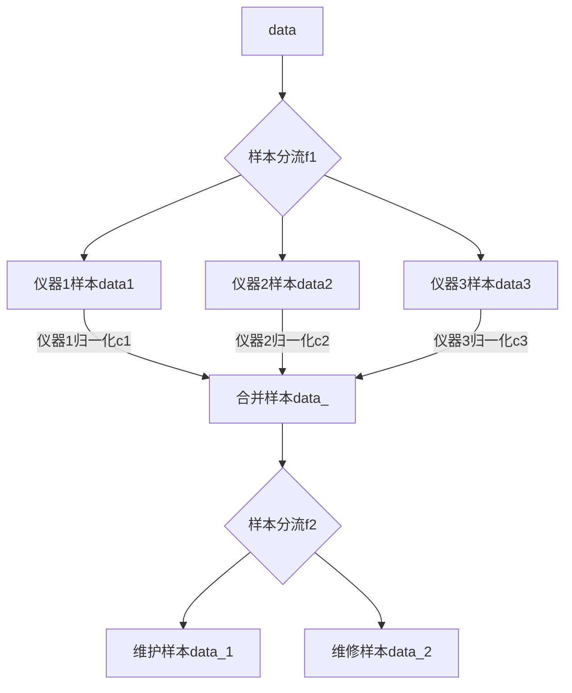

## 特征工程设计


### 样本分类流程

绘出对应的样本流程图

可以看到样本分流是非常严重的，至少经过了两次分流来提取有用信息


对于第一级样本分流f1，绘出分流表

可以看到不同仪器分流是很严重的，主要表现在仪器型号过多

在这一条件下，想要每个仪器模型都能得到好的效果，是很难的

而我们需要的是一揽子的解决方案，落地之后软件只对某几类型的仪器有用是不可行的，因为我们需要指导工程师的维护模式。

> 当然如果由主要几种仪器我们就能定义一种模式，而其他仪器做相同的维护，似乎也是可行的

| 设备型号             | 样本量 |
| :------------------- | :----- |
| 1235-514             | 1683   |
| GSL-120              | 675    |
| 2021-0010            | 594    |
| 2081-0010            | 524    |
| GSL-120/GSL-10       | 399    |
| GCS3000DX2           | 393    |
| 1235-5220            | 391    |
| 1420-020             | 389    |
| TQD                  | 353    |
| CDS-5                | 308    |
| 1235-501             | 240    |
| Capillarys 2 FP      | 229    |
| Xevo TQD             | 126    |
| Quattro Micro        | 82     |
| 6000                 | 77     |
| 6000-0010            | 64     |
| KM1                  | 63     |
| CaptureStation       | 43     |
| 1420-012             | 40     |
| 1296-026             | 35     |
| luminex 200          | 31     |
| ...          | ...     |

**所以面临的问题就是数据差异化较大而样本量较小，使用分流建多模型的方案时少量的数据难以提供足够信息。**


### 对应解决思路

- 设计一套方案，抹平仪器间的差异，模型使用的特征在所有仪器间通用，也就是拔掉第一次样本分流f1


这就需要发现仪器数据间的差异，构造特征将差异归一化。

差异存在于什么地方呢？差异只存在于文本列，也就是`问题汇总`, `解决方案汇总` 两列

一旦抹平了差异，模型的流程图就会变成




- 可以看到采用这种方式就只需要将样本分流一次，构造维护和维修两个模型就好

所以接下来的问题就是如何在做文本挖掘的特征工程的时候，将仪器间的差异化抹掉。

**目前的设想，是采用将实际问题实体转化为定性的样本，再转化为定量来解决这个问题。**


### 挖掘自定义词典

jieba分词有调整词典和命名实体识别的功能

对于问题的定义，需要先将对应的专有名词划出来建立问题对应的userdict保证问题的提取


#### 问题特征、结果特征：problem.txt

保存四类词：

1. zc1：已解决问题标签
2. zc2：无法解决问题标签
3. zp1：严重问题标签
4. zp2：一般问题标签


#### 仪器特征：instrument.txt

定义各仪器的专有名词 n


### 特征工程

基础特征总共有15个特征

```
'服务单号', '客户名称', '客户类型', '紧急程度', '问题发现日期', '分配工程师', '设备编号', '设备型号',
'服务工时(小时)', '服务间隔天数', '上次维修时间', '装机日期', '维修服务内容', '问题汇总', '解决方案汇总'
```


#### 构造特征

由于每条样本都是一条单独的维修记录，不用把该仪器设备单独提出来做连续的时间线，只需要把每个时间点的仪器当成一台平行时空下的独立的仪器就好。

对于该条样本下，该仪器当前的状态构建以下特征：

1. 该仪器型号的平均使用年限：定义一台仪器淘汰所需要的平均年限，需要找工程师问有哪些仪器是已经报废的，报废时间及装机时间
2. 该仪器型号报废前的平均维修次数：可精确到各个部件各维修的次数
3. 该仪器最近一年的维修次数
4. 该仪器最近一年的维修次数占对应客户最近一年的总维修次数的比
5. 仪器对应客户最近一年的维修总次数
6. 仪器最近一年遭遇严重问题zp1的次数
7. 仪器最近一年遭遇zp1在总次数中的占比
8. 仪器距离上一次维修的时间间隔
9. 仪器距离上一次维护的时间间隔
10. 该仪器的已使用年限
11. 同类仪器对应使用年限时的平均维修次数
12. 。。。


### 预测目标y

该仪器下一次维修的时间间隔

