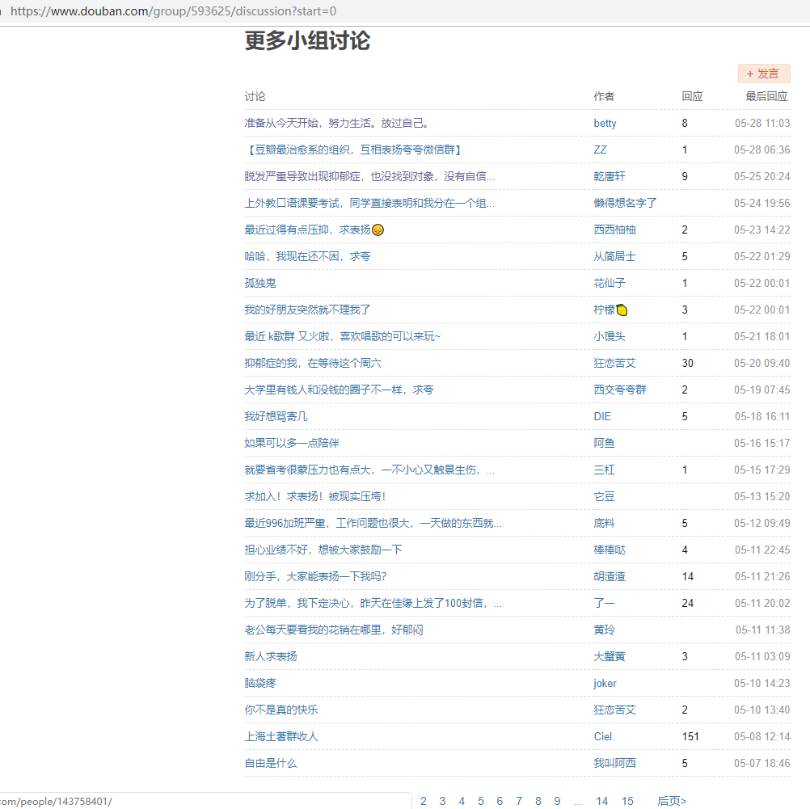
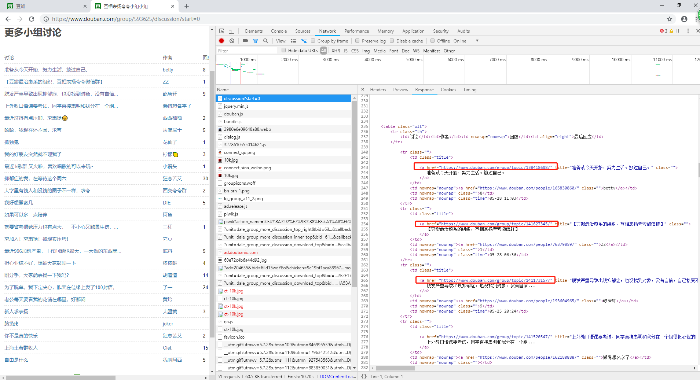
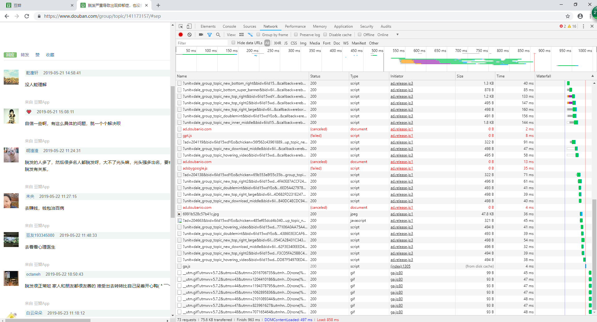
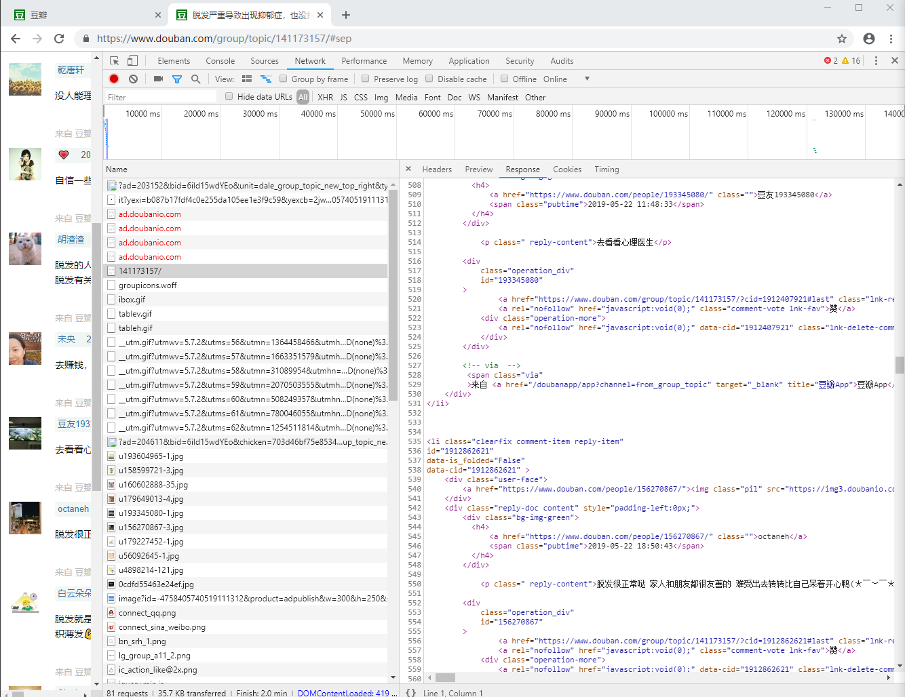
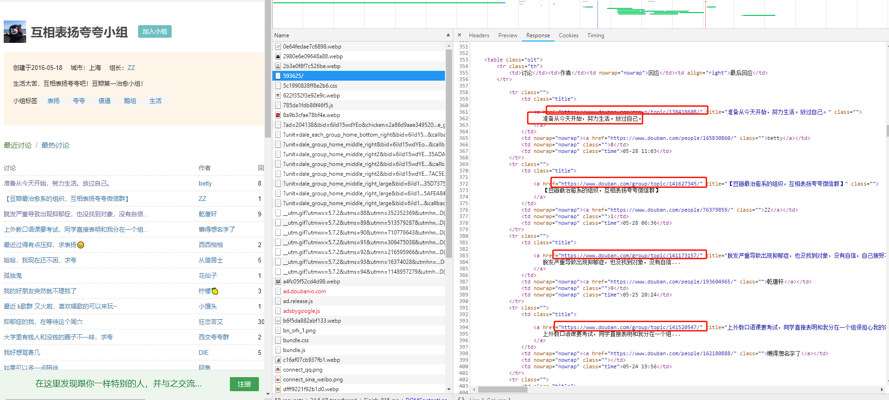
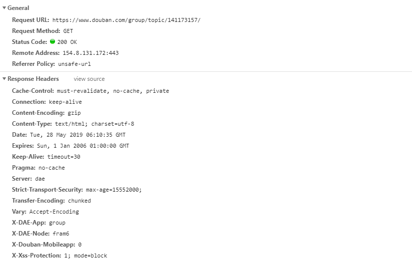
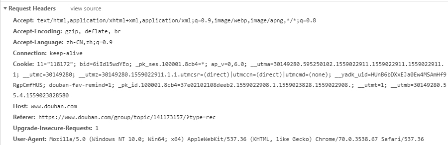
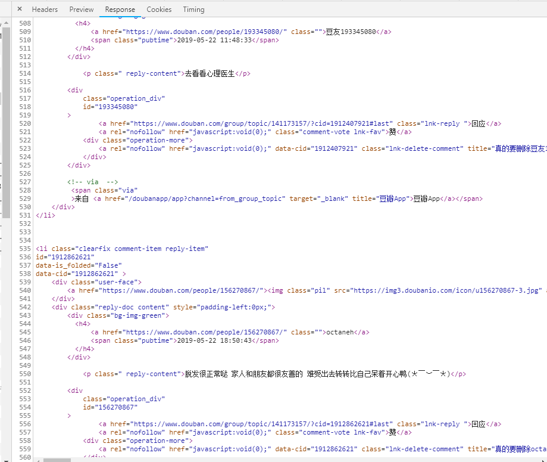
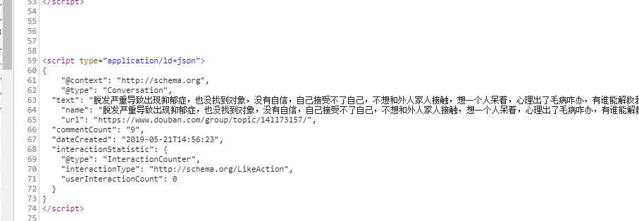
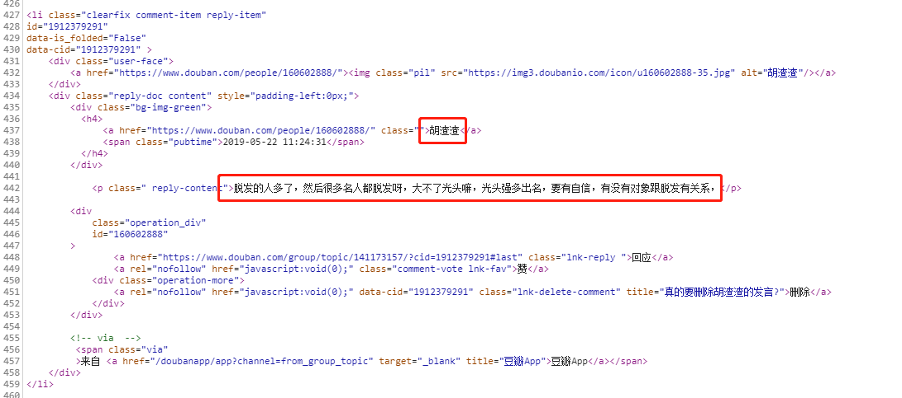

## 简易豆瓣小组评论语料爬虫

由于项目抓取语料需要写的一个豆瓣小组的爬虫，详细参考可见repo的《爬虫学习笔记》

### 实施步骤

#### 第一步：观察要爬虫的网站情况

豆瓣相互表扬小组：https://www.douban.com/group/593625/

点击页面的更多小组讨论：

可以看到每页有25条记录

第一页：https://www.douban.com/group/593625/discussion?start=0

第二页：https://www.douban.com/group/593625/discussion?start=25

所以我们可以以25为间隔实现翻页。

搜索我们需要爬取的目标：

观察一篇文章

我需要爬取的是网友们的评论

想得到的是所有的积极向上的评论，对于有点丧的，比如：有我严重么，我都快秃了

这些言论不是我们的目标

但可以在后期再对这部分评论进行处理，比如调模型做个情感分析的筛选。

当前爬虫的目标是爬取所有的评论。

这个时候我们打开Chrome按下F12，选择Network标签

由于开始默认是在`回应`这一栏，是预先读取的，我们需要切换点击一下就可以看到所有的内容

这条记录为

https://www.douban.com/group/topic/141173157/#sep

可以看到所有的回复内容都在文件 141173157/下

从而可以得出这个网页的结构，那么我们等会在 python 中可以用一个变量，来实现获取不同页数的内容。

对应的标题名和页面可以在夸夸小组的`593625/`文件处找到

通过chrome可以观察GET请求，我们的请求头和响应体

接着我们再来分析一下我们要抓取的关键信息，我们想要的是

- 文章的标题名：

- 评论的内容

#### 第二步：实操

主要思路：

- 使用page变量来实现对每个页面id的提取
- 我们使用requests请求豆瓣
- 然后将返回的HTML进行正则解析
- 解析完将内容保存到文件中

